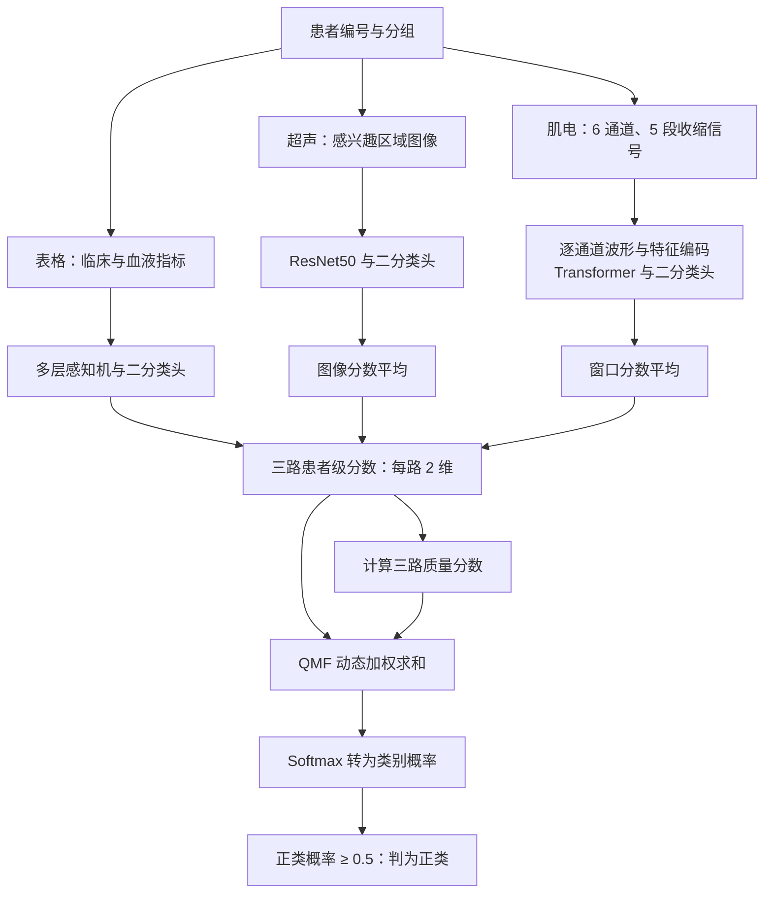
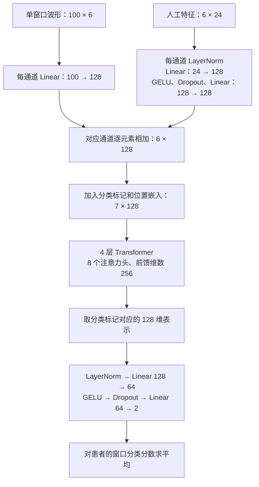
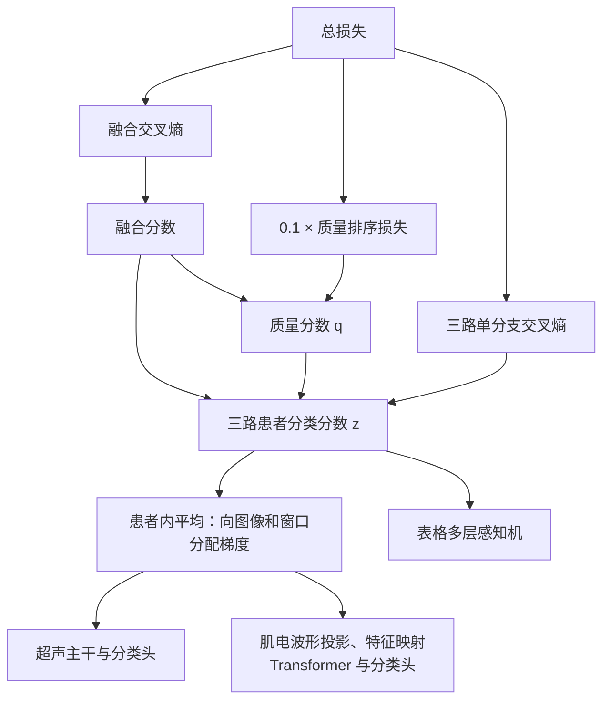

# QMF三模态融合汇报

方案的主体是三个单分支网络。它们分别输出患者级分类分数，QMF 根据这些分数计算模态质量，再完成加权融合。训练从三路网络联合优化开始：超声主干用 ImageNet 权重初始化，肌电和表格网络随机初始化，由分类损失和质量排序损失共同更新。

## 1. 先统一患者，再处理三路数据

### 1.1 患者与数据

最终纳入三路数据能够对应的 **85 名患者**，其中正类 62 名、负类 23 名。以患者编号关联超声、肌电和表格，同一患者的所有图像和肌电窗口始终属于同一个数据划分。

表格输入沿用 v1.4 的字段清单。



### 三路数据怎样对齐

对齐单位是患者编号。每名患者对应一条记录，里面保存全部超声图像路径、一份六通道肌电记录、一行临床与血液指标，以及一个标签。三路输入的数量可以不同，进入融合前各自汇总成两个患者级分类分数。

以一名有 8 张超声图像的患者为例：

| 阶段 | 超声输入 | 肌电输入 | 表格输入 | 融合前的处理 |
| --- | --- | --- | --- | --- |
| 训练 | 每次抽到该患者时随机选 1 张，并进行增强 | 从该患者五段信号中各抽 8 个窗口，共 40 个 | 该患者的一行指标 | 超声输出 2 个分数；肌电窗口分数平均为 2 个；表格输出 2 个 |
| 验证和测试 | 使用全部 8 张，关闭增强 | 使用该患者全部 1,655 个窗口 | 同一行指标，使用训练阶段拟合的预处理参数 | 分别平均图像分数与窗口分数，再与表格分数融合 |

因此，一次训练样本始终是一名患者：抽到哪张超声图像，都与该患者的肌电和表格配对。图像数量更多的患者也只占一个患者样本；验证和测试均按患者汇总后计算指标。

### 1.2 超声：保留区域比例，训练抽图、评估汇总

使用 v1.4 数据中的超声感兴趣区域，每名患者有 2～14 张图像。图像转为三通道，在保持长宽比的情况下缩至不超过 `224 × 224`，居中补黑边；小图不额外放大。像素缩放至 0～1 后，使用 ImageNet 的均值与标准差归一化。

训练时每名患者随机取 1 张图，进行概率为 0.5 的水平翻转，以及轻量亮度和对比度变化：亮度系数为 0.92～1.08，对比度系数为 0.90～1.10。评估时不增强，使用该患者全部图像，**先平均二分类分数，再参与三模态融合**。

### 1.3 肌电：六通道对齐、分段、切窗与特征提取

肌电输入由两部分组成：**100 毫秒的六通道波形，以及每通道 24 项人工特征**。波形保留短时信号形态，人工特征提供幅值、频谱和小波能量信息。

处理顺序如下：

1. 按已有通道审计记录统一六个通道的对应关系，按 1,000 Hz 采样率读取信号。
2. 使用三阶 Butterworth 10～499 Hz 带通滤波，以及 50 Hz 陷波滤波，陷波品质因数为 35；采用前后向滤波。
3. 提取 50～60、70～80、90～100、110～120、130～140 秒的五段收缩信号，每段 10 秒。
4. 每段独立切成长度 100 个采样点、步长 30 个采样点的窗口，即窗长 100 毫秒、步长 30 毫秒。每段得到 331 个窗口，每名患者共 1,655 个窗口。
5. 仅用当前训练患者的窗口拟合六个通道的均值和标准差，再对训练、验证与测试信号进行相同的标准化。
6. 从标准化后的每个窗口中提取每通道 24 项特征，六通道合计 144 维。

对于特殊记录，31 号患者直接使用已滤波信号及收缩标记，各段插值到 10,000 点；`s016` 缺少的第六通道以其余通道逐采样点的中位数补齐，并保留缺失标记。

| 特征组 | 每通道数量 | 内容 |
| --- | ---: | --- |
| 时域 | 6 | 均方根、平均绝对值、绝对峰值、过零次数、波形长度、斜率符号变化次数 |
| 傅里叶频谱 | 9 | 五个频带的能量、频谱质心、峰值频率、中值频率、平均功率频率 |
| 短时傅里叶变换 | 5 | 五个频带的平均谱能量，变换窗长 64、步长 32、变换点数 128 |
| 小波 | 4 | db4 三级分解得到的四组系数能量 |

五个频带为 0～50、50～100、100～200、200～400、400～500 Hz。其中频谱质心与平均功率频率采用相同计算式，占据两个特征位置。

训练时，每段随机抽取 8 个窗口，一名患者合计 40 个窗口，以控制计算量并覆盖五段收缩。评估时使用全部 1,655 个窗口，将预测汇总为一个患者级结果。

### 1.4 表格：训练集决定保留字段与标准化参数

候选输入共 95 项，包括 40 项临床指标和 55 项血液指标。临床指标包含年龄、性别、身高、体重、体质指数、病程、合并疾病、活动能力、腿围及相关量表指标等，沿用 v1.4 的字段选择。

每次训练分别完成以下处理：删除训练集中缺失比例超过 50% 的列和常数列，用训练集的中位数填补缺失值，再用训练集均值与标准差标准化。验证与测试直接使用这些参数。每次训练最终保留的字段数记为 D，也是表格网络的输入维数。

## 2. 三个单分支网络分别学什么

三个网络最终都输出两个未归一化分类分数，以下称为 **分类分数**，记作 zₘ = (zₘ,₀, zₘ,₁)。下标 m 表示超声、肌电或表格，第二个下标 0、1 分别对应负类和正类。这两个分数经过 Softmax 后才成为类别概率；后文的融合运算直接使用分数。

### 2.1 超声：ResNet50 提取图像表征

网络结构为：

```text
3 × 224 × 224 图像
→ ResNet50 主干与全局平均池化
→ 2048 维特征
→ Dropout(0.35)
→ Linear(2048, 2)
→ 图像分类分数
```

初始化使用已下载的 `resnet50-11ad3fa6.pth`。替换原有分类层后，主干和新分类头一起训练。超声分支共 **23,512,130 个参数**。

对同一患者的图像分数求平均，其中 N 为图像数，上标 r 为图像编号：

$$
z_{\text{超声}}=\frac{1}{N_{\text{图像}}}\sum_{r=1}^{N_{\text{图像}}}z^{(r)}_{\text{超声}}.
$$

### 2.2 肌电：波形与人工特征先在通道内融合，再建模通道关系

肌电分支沿用“肌电分类程序”中的 `FTTransformerRaw` 结构，适配为六通道、二分类。网络先为每个通道建立一个表示，再通过自注意力学习六个通道之间的关系。



波形投影和人工特征映射在六个通道之间共享参数；位置嵌入区分通道位置。分类标记是额外加入的可学习向量，经过注意力交互后汇集六个通道的信息。

Transformer 的表示维数为 128，采用四层编码器，每层八个注意力头，前馈层维数为 256，Dropout 为 0.2，先进行层归一化再进入注意力或前馈模块。网络共 **572,274 个参数**。

人工特征通过逐通道映射分支进入网络，在 Transformer 之前与波形表示相加。Transformer 完成一个窗口内的通道交互后，分类头输出该窗口的两个分数；最后对所有窗口求平均，得到患者级肌电输出：

$$
z_{\text{肌电}}=\frac{1}{N_{\text{窗口}}}\sum_{r=1}^{N_{\text{窗口}}}z^{(r)}_{\text{肌电}}.
$$

这里 N 为窗口数，r 为窗口编号；训练取 40 个窗口，评估使用全部 1,655 个。

### 2.3 表格：小型多层感知机

```text
D 维标准化指标
→ Linear(D, 64) → LayerNorm → GELU → Dropout(0.2)
→ Linear(64, 32) → GELU
→ Linear(32, 2)
→ 患者分类分数
```

表格网络参数量为 64D + 2338。例如 D = 94 时为 **8,354 个参数**，三个分支合计 **24,092,758 个参数**。参数量主要来自超声主干，表格分支很小。

## 3. QMF 怎样融合，怎样完成分类

### 3.1 从分类分数计算模态质量

完成患者内平均后，三个分支输出组成形状为 `[患者数, 3, 2]` 的张量。对每名患者、每个模态，QMF 由分支分数 zₘ 计算一个质量分数 qₘ：

$$
q_m=\frac{1}{10}\log\left(e^{z_{m,0}}+e^{z_{m,1}}\right).
$$

其中 log 为自然对数，代码使用 `logsumexp` 稳定计算。随后，将每个模态的两个分类分数都乘以该模态的质量分数：

$$
z_{\text{融合}}=q_{\text{超声}}z_{\text{超声}}
+q_{\text{肌电}}z_{\text{肌电}}
+q_{\text{表格}}z_{\text{表格}}.
$$

同一套网络面对不同患者时，会得到不同的 qₘ。这种随患者变化的加权方式，让三路分支以不同强度参与最终预测。融合直接发生在分类分数上，所需的质量计算也由分支输出完成。

qₘ 是未经归一化的融合系数，取值受分类分数的绝对尺度影响，可以为负。训练时通过质量排序损失，将它与分支的历史分类表现联系起来。

### 3.2 从融合分数得到二分类结果

用融合分数的两个分量分别表示对负类和正类的打分，下标 0 对应负类，下标 1 对应正类。对这两个分量执行 Softmax，得到正类概率 p₁：

$$
p_1=\frac{e^{z_{\text{融合},1}}}
{e^{z_{\text{融合},0}}+e^{z_{\text{融合},1}}}.
$$

采用固定阈值 0.5：p₁ ≥ 0.5 判为正类，否则为负类。到这里，图像和肌电窗口的信息经过患者内平均与跨模态融合，得到一个最终分类结果。

## 4. 损失由三部分组成

### 4.1 融合与单分支都接受标签监督

为照顾类别数量差异，当前训练集内类别 c 的权重为：

$$
w_c=\frac{N}{2n_c},
$$

其中 N 为当前训练集的患者数，n꜀ 为类别 c 的患者数，w꜀ 是该类别对应的权重。人数越少的类别，权重越大。

下式中，i 标记批次内的患者，yᵢ 为真实标签，zᵢ 为分类分数。损失取真实类别概率的负对数，再按类别权重平均：

$$
L_{\text{分类}}(z,y)=
\frac{\sum_i w_{y_i}\left[-\log\operatorname{Softmax}(z_i)_{y_i}\right]}
{\sum_i w_{y_i}}.
$$

同一个交叉熵函数分别作用于融合输出和三个分支输出。将四个结果依次记为融合损失、超声损失、肌电损失和表格损失，加起来得到监督损失：

$$
L_{\text{监督}}=L_{\text{融合}}+
L_{\text{超声}}+L_{\text{肌电}}+L_{\text{表格}}.
$$

四项系数均为 1。融合损失优化联合预测，单分支损失则为各网络提供直接的分类监督。

### 4.2 用历史分类损失监督质量排序

QMF 希望质量分数反映预测可靠性：**q 越高，分类损失越低**。训练通过历史损失建立排序目标，评估时再检查这一关系能否在未参与训练的患者上成立。

为每个训练患者、每个模态维护一个历史量 hᵢ,ₘ：该患者此前被该分支预测时，**未加类别权重的交叉熵累计值**。该历史量仅在训练阶段更新，并作为固定目标参与本批次的排序计算。

在每个批次内，将患者顺序循环移动一位形成配对 (i, j)。对每个模态定义两个量：s 表示期望的排序方向，取值为 −1、0 或 1；d 表示归一化后的历史损失差距，用作质量分数应达到的间隔。下式中的 sign 是取符号函数，k 遍历训练集患者：

$$
s_{ij,m}=\operatorname{sign}(h_{j,m}-h_{i,m}),\qquad
 d_{ij,m}=\frac{|h_{i,m}-h_{j,m}|}
{\max_k h_{k,m}-\min_k h_{k,m}}.
$$

分母使用整个训练集该模态的历史范围，并以 10⁻¹² 为下限。当前实现的排序损失为：

$$
L_{\text{排序}}=
\sum_m\operatorname{mean}_{(i,j)}
\max\left(0,d_{ij,m}-s_{ij,m}(q_{i,m}-q_{j,m})\right).
$$

式中 qᵢ,ₘ 是患者 i 在模态 m 上的质量分数。max(0, …) 只保留未满足间隔的部分；mean 表示在当前批次的患者配对上取平均，最外层求和再把三个模态的排序损失相加。

例如，患者 i 的历史损失更低，则 s = 1，损失鼓励其质量分数比患者 j 高出至少 d。这样的配对把同一模态在不同患者上的分类表现，转化为质量分数之间的相对顺序。

每个批次先用旧历史计算排序损失，再把当前分支交叉熵加入历史。初始历史全为零，因此首轮相应排序项为零。

### 4.3 QMF 总损失

总损失 L 由分类监督和质量排序组成。Lₘ 表示第 m 个分支的加权交叉熵，求和范围为超声、肌电、表格三个分支；排序项系数为 0.1。

$$
\boxed{
L=L_{\text{融合}}+\sum_mL_m+0.1L_{\text{排序}}
}
$$

排序目标来自历史记录，梯度则通过当前质量分数回到分支网络。

## 5. 梯度如何回到三个网络



上图箭头表示梯度回传方向。QMF 的质量计算保留梯度，因此融合损失会通过两条路径更新分支：一条直接经过加权分数 qₘzₘ，另一条经过质量计算 qₘ(zₘ)。

用 g 表示融合损失对融合分数的梯度，则：

$$
\frac{\partial L_{\text{融合}}}{\partial z_m}
=q_mg+(g^\top z_m)\frac{\operatorname{Softmax}(z_m)}{10}.
$$

左侧表示融合损失对分支分数的梯度；gᵀzₘ 为两向量的点积。

右侧第一项 qₘg 来自直接加权，第二项来自质量函数，其 Softmax(zₘ)/10 正是质量分数对分支分数的导数。再加上单分支交叉熵及排序项的梯度，共同更新对应网络。

对于肌电，患者分数由多个窗口平均得到，梯度按平均操作分配到各窗口，并继续回传到分类头、Transformer、波形投影和人工特征映射层。其中，人工特征是预先计算的输入，特征映射层的参数随网络一起更新。

每个批次只需一次总损失反向传播，随后把全部参数的梯度范数裁剪至最多 5，再由同一个 AdamW 优化器更新三路网络。

## 6. 训练与评估：先确定轮数，再训练测试模型

85 名患者按标签分层分成五折，每折 17 人。同一患者的图像、肌电和表格放在同一折。每次留一折测试，用其余四折完成训练。

### 以第 0 折作为测试集为例

1. **确定训练轮数。** 用第 2、3、4 折的 51 人训练，第 1 折的 17 人验证。最多训练 100 轮，记录验证损失最低的轮次；连续 12 轮没有改善就停止。假设最佳轮次为 78。
2. **训练最终模型。** 重新初始化网络，合并第 1～4 折的 68 人，固定训练 78 轮。超声主干仍加载同一份 ImageNet 权重，其他部分重新随机初始化。
3. **评估测试集。** 用这个模型预测第 0 折的 17 人，保存每人的分类概率。

验证集用来决定训练多久，随后加入训练，让最终模型用上测试集之外的全部 68 人。

### 五折依次轮换

| 测试折 | 确定轮数时的训练折 | 验证折 | 最终模型的训练折 |
| --- | --- | --- | --- |
| 0 | 2、3、4 | 1 | 1、2、3、4 |
| 1 | 0、3、4 | 2 | 0、2、3、4 |
| 2 | 0、1、4 | 3 | 0、1、3、4 |
| 3 | 0、1、2 | 4 | 0、1、2、4 |
| 4 | 1、2、3 | 0 | 0、1、2、3 |

完成五次后，85 名患者各得到一次作为测试样本时的预测，这就是**折外预测**。每种融合方法用随机种子 42、43、44 各执行一遍上述流程，再对同一患者的三个预测概率取平均，计算最终指标。

### 划分一致性与数据隔离

三种融合方法共用同一份五折名单，划分种子为 `20260911`。表格筛列、缺失值填补、标准化和类别权重只根据当次训练患者计算；合并重训时在 68 人上重新计算。已核对全部 45 组实验，测试患者均未进入对应的训练或验证集。

文中的单分支指标取自联合训练模型的三个输出头，与融合指标使用相同的测试患者。训练参数统一列在文末附录。

## 7. 另外两种融合怎样作为对照

三个方法使用同样的数据划分、分支架构和训练参数，分别从初始化开始联合训练。融合方式改变后，损失与梯度也随之变化，因此各自训练出的单分支会有所不同。

### 7.1 等权晚期融合

三个患者级分数直接取平均，再经过 Softmax：

$$
z_{\text{等权}}=\frac{z_{\text{超声}}+z_{\text{肌电}}+z_{\text{表格}}}{3}.
$$

损失为融合交叉熵与三路单分支交叉熵之和。它为动态加权提供了一个直接对照：在相同的分支结构下，将融合系数固定为三分之一。

### 7.2 TMC：融合类别证据

TMC 用 Softplus 将分类分数转为非负证据 eₘ，表示对各类别的支持强度，再构成 Dirichlet 分布参数 αₘ = eₘ + 1。二分类中，两路证据的 Dempster–Shafer 合成可等价写为逐类别计算：

$$
e_{a\oplus b}=e_a+e_b+\frac{e_ae_b}{2}.
$$

式中的 a、b 表示待合成的两路输入，⊕ 表示证据合成，乘法按类别逐元素计算；分母 2 是类别数。合成证据加 1 后得到融合的 α 参数。当前实现先合成超声与肌电，再合成表格。最终正类概率为 α₁ / (α₀ + α₁)，整体不确定性为 2 / (α₀ + α₁)。

每个分支及融合输出均使用证据学习损失：

$$
L_{\text{证据}}=
\sum_c y_c[\psi(S)-\psi(\alpha_c)]
+\lambda_t\operatorname{KL}\left[\operatorname{Dir}(\widetilde\alpha)
\Vert\operatorname{Dir}(\mathbf1)\right],
$$

其中 c 为类别，y 为真实标签的独热编码，S 为两类 α 参数之和，ψ 为双伽马函数。Dir 表示 Dirichlet 分布，KL 衡量分布差异，Dir(1) 为均匀分布。

α̃ = y + (1 − y)α 将真实类别的参数设为 1，使正则项主要约束错误类别的证据。第一项推动正确类别的证据增加，第二项约束错误类别的多余证据。退火系数 λₜ 控制第二项的强度，t 为当前轮次，从 1 开始计数。采用 λₜ = min(1, t/10)，即前十轮逐步加大约束，第十轮起保持为 1。各患者按类别权重求平均，融合与三个分支的证据损失相加，构成 TMC 的训练目标。

## 8. 实验结果：QMF 提升了什么，信息主要来自哪里

以下结果来自 85 名患者的五折折外预测，并对三个训练种子的概率取平均。曲线下面积指受试者工作特征曲线下面积（ROC-AUC）；准确率、敏感度与特异度均使用阈值 0.5。敏感度对应正类识别能力，特异度对应负类识别能力。

### 8.1 三种融合方法比较

| 融合方法 | ROC-AUC | 准确率 | 敏感度 | 特异度 | 平衡准确率 |
| --- | ---: | ---: | ---: | ---: | ---: |
| 等权晚期融合 | 0.8541 | 82.35% | 93.55% | 52.17% | 72.86% |
| **QMF 动态融合** | **0.8703** | **83.53%** | **93.55%** | **56.52%** | **75.04%** |
| TMC 证据融合 | 0.9004 | 81.18% | 96.77% | 39.13% | 67.95% |

QMF 相比等权融合，ROC-AUC 提高约 0.0161，正确分类人数由 70 人增加到 71 人。在保持 58 名正类识别正确的同时，正确识别的负类由 12 人增加到 13 人。

QMF 的混淆矩阵为：

| 实际类别 | 预测负类 | 预测正类 |
| --- | ---: | ---: |
| 负类，23 人 | 13 | 10 |
| 正类，62 人 | 4 | 58 |

TMC 的 ROC-AUC 最高，但在 0.5 阈值下更倾向于预测正类：识别出 60 名正类，同时将 14 名负类误判为正类。因此，本次结果中 **QMF 的准确率和敏感度／特异度平衡最好，TMC 的概率排序能力最好**。

### 8.2 QMF 联合训练后的三个分支

| QMF 内部单分支 | ROC-AUC | 准确率 | 平均质量分数 |
| --- | ---: | ---: | ---: |
| 超声 | 0.6122 | 72.94% | 0.2458 |
| 肌电 | 0.4123 | 67.06% | 0.1414 |
| 表格 | 0.8969 | 78.82% | 0.3401 |

单分支指标取自 QMF 联合训练模型的三个输出头。分支概率也先按三个种子平均后评估；质量分数则为所有种子折外输出的平均。

表格分支是当前主要的信息来源；超声具有一定区分能力；肌电 ROC-AUC 低于 0.5，尚未形成有效的正向区分能力。平均质量分数也呈现表格最高、肌电最低的趋势。

与最强的表格分支相比，QMF 将准确率从 78.82% 提高到 83.53%，ROC-AUC 则从 0.8969 降至 0.8703。融合改善了 0.5 阈值下的分类结果，表格分支仍保持更好的概率排序表现。

为观察不同训练目标对分支的影响，三种方法的单分支 ROC-AUC 如下：

| 训练所用融合方式 | 超声分支 | 肌电分支 | 表格分支 |
| --- | ---: | ---: | ---: |
| 等权晚期融合 | 0.5582 | 0.4130 | 0.8822 |
| QMF | 0.6122 | 0.4123 | 0.8969 |
| TMC | 0.6697 | 0.4348 | 0.8892 |

### 8.3 质量与分类损失的关系

逐个测试折计算 q 与对应分支交叉熵的相关性。三个种子共得到 15 个折内系数：超声和表格的 Spearman 均为负，肌电为 13/15 个负值；中位数分别为 −0.564、−0.855 和 −0.414。表格的质量排序关系最稳定，肌电的线性相关性较弱。

同时检查分数尺度。三个种子中，肌电 q 与两类分数均值的 Pearson 相关性为 0.940～0.969。给超声两类分数同时减 1，单分支概率不变，但集成后的融合分类有 3 名患者发生变化。这说明质量分数受到整体分数偏移影响，需要结合损失关系解释。

### 8.4 指标的不确定性

对 85 名患者进行 10,000 次类别分层配对重采样，得到以下 95% 置信区间。三个种子先按患者集成，区间基于现有折外预测。

| 方法 | ROC-AUC（95% CI） | 准确率（95% CI） |
| --- | --- | --- |
| 等权融合 | 0.8541（0.7518～0.9376） | 82.35%（75.29%～89.41%） |
| QMF | 0.8703（0.7805～0.9432） | 83.53%（76.47%～90.59%） |
| TMC | 0.9004（0.8282～0.9593） | 81.18%（75.29%～87.06%） |

QMF 相比等权融合的 AUC 差值为 0.0161，95% CI 为 -0.0196～0.0554，包含 0。因此，目前的结果是点估计提高，多正确识别 1 人；排序项的作用将通过无排序、原排序与当前排序的消融进一步比较。

完整相关性、尺度分布及各项指标区间见[补充分析报告](/home/wp24/mix/qmf_trimodal_joint_v1_4/reports/qmf_diagnostics/report.md)，消融设置见[训练说明](/home/wp24/mix/qmf_trimodal_joint_v1_4/docs/qmf_ablations.md)。

## 9. 在原 QMF 仓库上做了哪些适配

适配以原 QMF 仓库的 RGB-D 场景分类实现为起点。原任务输入彩色图像和深度图像，本项目将输入扩展为超声、肌电和表格，同时沿用分类分数估计质量、动态加权、单分支监督和历史损失排序的训练思路。

| 环节 | 原仓库参考实现 | 本项目的实现与改动原因 |
| --- | --- | --- |
| 数据对象 | RGB 与深度图像、场景类别 | 超声、肌电、表格及患者二分类；匹配实际数据形式 |
| 分支编码器 | 两路 ResNet18 | ResNet50、六通道肌电 Transformer、表格多层感知机；各自处理对应输入 |
| 样本组织 | 图像样本 | 多张图像和多个肌电窗口先汇总到患者；使三路输出对应同一个标签 |
| 动态融合 | 由 `logsumexp / 10` 得到质量，再加权分数 | 保留公式及质量计算的梯度，由两路扩为三路 |
| 分类监督 | 融合输出与单分支交叉熵 | 保留监督结构，加入训练集类别权重，适应 62∶23 的类别分布 |
| 质量历史 | 累计单样本交叉熵，批次循环配对 | 保留机制，按患者记录三个模态，并对零历史范围作数值保护 |
| 排序间隔 | 原代码的间隔符号 | 改为正间隔约束，使质量差距对应历史损失差距 |
| 优化与评估 | 原场景任务的优化器、调度与数据划分 | AdamW、分组学习率、梯度裁剪和患者级五折选轮重训，适配小样本及预训练主干 |

### 排序间隔的调整

沿用第 4 节的历史量 h 和归一化差距 d，暂时省略模态下标 m。这里按原代码定义 r = sign(hᵢ − hⱼ)，其方向与第 4 节的 s 相反；qᵢ、qⱼ 分别是这对患者的质量分数。当 r ≠ 0 时，原 RGB-D 训练脚本中的 `MarginRankingLoss` 展开为：

$$
L_{\text{原}}=\max(0,r(q_i-q_j)-d).
$$

当前保留实验则为：

$$
L_{\text{当前}}=\max(0,r(q_i-q_j)+d).
$$

间隔项由 −d 改为 +d，改变了排序约束的强度。以 hᵢ < hⱼ 为例，原式在 qᵢ − qⱼ ≥ −d 时损失为零，当前式则要求 qᵢ − qⱼ ≥ d。当前实现因此明确推动历史损失较低的患者获得更高的质量分数，并将两者的历史差距作为目标间隔。这是本项目在原 QMF 训练目标上的一项实质调整。

等权融合只是将两路平均自然扩展为三路平均。TMC 使用的证据合成式是原 Dempster–Shafer 规则的代数等价形式，减少了显式冲突分母的计算；训练中加入类别权重，并从第 1 轮开始计算退火系数：首轮为 0.1，第 10 轮达到 1；原实现从第 0 轮开始，首轮系数为 0。

## 10. 从结果看这条融合路线

这套方案把三种数据统一到了患者级分类分数，再用 QMF 学习随患者变化的融合系数。三个分支既接受各自的标签监督，也通过融合损失相互配合；历史损失则为质量学习提供排序目标。

本次实验中，QMF 相比等权融合多正确识别了一名负类患者，在三种融合方法中取得最高的准确率和平衡准确率。分支结果进一步解释了整体表现：表格提供了主要区分信息，超声带来一定补充，肌电仍是最需要改善的环节。后续工作的重点也由此落到肌电表示与跨模态互补上。


## 附录：实验参数汇总

正文按流程介绍参数，这里集中列出 `formal_v1` 的配置项，以及网络和训练代码中固定的设置。表中的 E 是每折验证损失最低时的轮次。

### 训练、划分与模型保存

| 参数 | 设置 |
| --- | --- |
| 融合方法 | QMF、等权晚期融合、TMC，各自独立联合训练 |
| 患者数与类别数 | 85 人；二分类，正类 62 人、负类 23 人 |
| 划分 | 患者级分层五折；划分种子 20260911 |
| 训练种子 | 42、43、44；各折实际初始化种子为训练种子加折编号 |
| 每折选轮阶段 | 51 人训练、17 人验证、17 人留作测试 |
| 每折重训阶段 | 68 人训练、17 人测试；重新初始化并重拟合预处理 |
| 最大轮数与早停 | 最多 100 轮；验证损失连续 12 轮未改善时停止 |
| 选轮指标 | 验证集未加类别权重的对数损失，越低越好；严格下降即记为改善 |
| 最终模型 | 合并训练和验证数据，从初始化开始训练 E 轮，保存该轮模型用于测试 |
| 检查点 | 选轮和重训阶段每轮保存 last.pt；最终测试模型为 model.pt |
| 训练批次 | 6 名患者；每轮打乱，保留不足 6 人的末批次 |
| 优化器 | AdamW；β₁ = 0.9、β₂ = 0.999、ε = 10⁻⁸ |
| 学习率 | 超声主干 10⁻⁵；超声分类头、肌电、表格均为 2 × 10⁻⁴ |
| 权重衰减 | 全部优化器参数组均为 10⁻³ |
| 梯度更新 | 每批次更新一次，梯度累积步数为 1；全局梯度范数裁剪上限 5 |
| 学习率调度与预热 | 固定学习率，无调度和预热 |
| 数值精度 | 32 位浮点；关闭混合精度及 TF32 |
| 训练设备与线程 | CUDA；计算线程数 2；数据加载进程数 0；启用固定内存传输 |
| 随机性控制 | 设置 Python、NumPy、PyTorch 和 CUDA 种子；启用确定性算法，关闭 cuDNN 自动基准选择 |
| 集成与分类阈值 | 三个种子的患者折外概率取平均；阈值 0.5 |

### 输入与网络

| 参数 | 设置 |
| --- | --- |
| 超声输入 | 三通道、224 × 224；保留比例并补边；ImageNet 均值与标准差归一化 |
| 超声采样与增强 | 训练每患者随机 1 张；水平翻转概率 0.5，亮度 0.92～1.08，对比度 0.90～1.10 |
| 超声评估 | 全部图像，每次推理最多 2 张，患者内平均分数 |
| 超声网络 | ResNet50；ImageNet 权重 resnet50-11ad3fa6.pth；2048 → 2 分类头，Dropout 0.35；全量微调 |
| 肌电采样与滤波 | 1,000 Hz；三阶 10～499 Hz 带通；50 Hz 陷波，品质因数 35；前后向滤波 |
| 收缩段 | 50～60、70～80、90～100、110～120、130～140 秒，共 5 段 |
| 肌电窗口 | 长度 100 点，步长 30 点；每段 331 个，每患者 1,655 个 |
| 肌电标准化 | 训练患者拟合六通道均值和标准差；标准差计算加 10⁻⁸，方差下限 10⁻¹² |
| 肌电训练采样 | 各段无放回随机抽取 8 个窗口，共 40 个；使用对应的 144 维特征 |
| 肌电评估 | 全部 1,655 个窗口，每次最多 256 个；先段内、再五段间平均分数 |
| 肌电特征 | 每通道 24 项：时域 6、频谱 9、短时频谱 5、小波能量 4 |
| 频域设置 | 五个频带：0～50、50～100、100～200、200～400、400～500 Hz；短时变换窗长 64、步长 32、变换点数 128；db4 三级小波分解 |
| 波形映射 | 每通道 100 → 128，六通道共享参数 |
| 人工特征映射 | 每通道 LayerNorm(24) → 24 → 128 → 128；GELU，Dropout 0.2 |
| 肌电编码器 | 6 个通道表示加 1 个分类标记；表示维数 128，4 层、8 头、前馈维数 256；GELU、Dropout 0.2、前置层归一化 |
| 肌电分类头 | LayerNorm(128) → 128 → 64 → 2；GELU、Dropout 0.2 |
| 表格预处理 | 95 项候选字段；剔除训练集中缺失比例超过 50% 的列及常数列，中位数填补并标准化；标准差小于 10⁻⁶ 时设为 1 |
| 表格网络 | D → 64 → 32 → 2；首层后 LayerNorm，两个隐藏层使用 GELU，首隐藏层 Dropout 0.2 |
| 参数训练范围 | 超声主干与分类头、肌电全部模块、表格全部层；肌电和表格随机初始化 |

### 融合与损失

| 参数 | 设置 |
| --- | --- |
| QMF 质量函数 | 两类分数的 logsumexp 除以 10；保留梯度 |
| QMF 分类监督系数 | 融合损失及三个单分支损失各为 1 |
| QMF 排序系数 | 0.1；当前批次循环移位配对，各模态内平均后对三路求和 |
| QMF 质量历史 | 从零开始累计未加权分支交叉熵；先计算排序项、再更新历史；重训时重新初始化 |
| 历史差距归一化 | 每个模态使用全训练集历史极差；分母下限 10⁻¹² |
| 类别权重 | 各阶段根据训练集计算：训练人数除以该类人数的两倍 |
| 等权融合 | 三路分类分数各乘三分之一；融合与三个分支交叉熵系数各为 1 |
| TMC 证据 | Softplus(分类分数)；Dirichlet 参数为证据加 1；先合成超声和肌电，再合成表格 |
| TMC 损失 | 融合与三个分支证据损失系数各为 1，按类别权重求平均 |
| TMC 退火 | 系数为 min(1, 当前轮次/10)，第 1 轮为 0.1，第 10 轮起为 1 |

---

### 实现与结果依据

代码位于 `qmf_trimodal_joint_v1_4`，实验编号为 `formal_v1`。下列文件分别对应本文的数据处理、网络、训练和结果分析。

- 数据处理：[data.py](/home/wp24/mix/qmf_trimodal_joint_v1_4/src/trimodal_joint/data.py)、[raw.py](/home/wp24/mix/qmf_trimodal_joint_v1_4/src/trimodal_joint/raw.py)、[features.py](/home/wp24/mix/qmf_trimodal_joint_v1_4/src/trimodal_joint/features.py)。
- 网络与融合：[models.py](/home/wp24/mix/qmf_trimodal_joint_v1_4/src/trimodal_joint/models.py)、[emg_model.py](/home/wp24/mix/qmf_trimodal_joint_v1_4/src/trimodal_joint/emg_model.py)、[fusion.py](/home/wp24/mix/qmf_trimodal_joint_v1_4/src/trimodal_joint/fusion.py)。
- 损失与训练：[losses.py](/home/wp24/mix/qmf_trimodal_joint_v1_4/src/trimodal_joint/losses.py)、[training.py](/home/wp24/mix/qmf_trimodal_joint_v1_4/src/trimodal_joint/training.py)、[base.yaml](/home/wp24/mix/qmf_trimodal_joint_v1_4/configs/base.yaml)。
- 结果数据：[formal_v1_analysis.json](/home/wp24/mix/qmf_trimodal_joint_v1_4/reports/formal_v1_analysis.json)。
- 原 QMF 排序实现：[train_QMF_nyud2.py](/home/wp24/mix/qmf_trimodal_joint_v1_4/third_party/qmf_reference/train_QMF_nyud2.py)。
