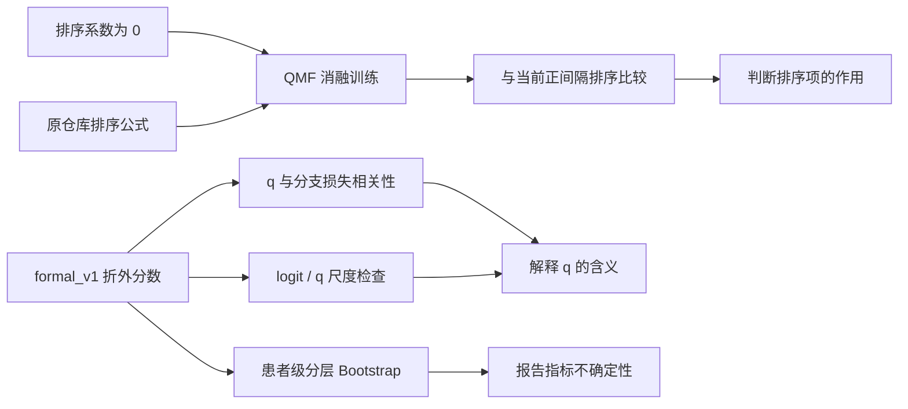

# QMF 三模态融合补充分析

这份补充报告接在《QMF 三模态融合汇报》之后，集中回答四个问题：质量分数是否满足“q 越高，分类损失越低”；不同分支的分类分数尺度是否影响了 q；主要指标在患者级重采样下有多稳定；原排序项和当前排序项到底带来了什么变化。

分析对象是 85 名患者的折外预测。相关性、尺度和平滑后的置信区间直接使用已经保存的 `formal_v1` 预测，不重新训练；两组排序消融各完成了 3 个随机种子 × 5 折的完整训练。

## 1. 分析口径

所有指标的独立单位都是患者。每名患者只有一次折外预测；超声图像和肌电窗口已经在模型内部汇总为患者级分数。三个随机种子的预测先对同一患者取平均，再计算最终指标。

相关性分析中的 loss 是对应分支对真实类别的未加权交叉熵。Pearson 相关系数看线性关系，Spearman 相关系数看排序关系。置信区间采用 10,000 次按类别分层的患者级配对 Bootstrap：每次对正、负类患者分别有放回抽样，各方法使用完全相同的患者索引。这个区间反映固定折外预测的不确定性，不包含重新训练造成的波动。

## 2. q 是否满足“q 越高，loss 越低”

QMF 的核心假设可以写成：**q ↑ ⇔ loss ↓**。质量分数高的患者，应该在该模态上有更低的分类损失。当前实现用训练历史中的分支损失建立排序约束，下面的分析则在未参与训练的测试患者上检查这个关系。

### 2.1 按随机种子汇总五折

| 种子 | 分支 | Pearson | Spearman |
| ---: | --- | ---: | ---: |
| 42 | 超声 | 0.055 | −0.461 |
| 42 | 肌电 | 0.007 | −0.375 |
| 42 | 表格 | −0.233 | −0.857 |
| 43 | 超声 | 0.051 | −0.466 |
| 43 | 肌电 | 0.104 | −0.255 |
| 43 | 表格 | −0.083 | −0.781 |
| 44 | 超声 | −0.117 | −0.599 |
| 44 | 肌电 | 0.257 | −0.288 |
| 44 | 表格 | −0.110 | −0.833 |

Spearman 在三个分支、三个种子中均为负，说明 q 的排序方向符合 QMF 设定。表格分支最稳定，三个种子的 Spearman 为 −0.781～−0.857；超声为 −0.461～−0.599；肌电为 −0.255～−0.375。Pearson 明显弱于 Spearman，说明 q 与 loss 的关系更接近单调关系，而不是简单的线性关系。

### 2.2 按测试折检查稳定性

每个种子有 5 个测试折，因此一共得到 15 个折内相关系数。下表统计 Spearman 为负的折数和中位数。

| 分支 | 负相关折数 | Spearman 中位数 | Pearson 中位数 |
| --- | ---: | ---: | ---: |
| 超声 | 15/15 | −0.564 | −0.096 |
| 肌电 | 13/15 | −0.414 | −0.077 |
| 表格 | 15/15 | −0.855 | −0.282 |

因此，当前结果支持“q 越高，loss 通常越低”的排序趋势，尤其是表格分支。肌电有两个折没有呈现负的 Spearman，说明它的质量排序还不稳定。这里验证的是相关性和排序一致性，不把它解释成严格的函数关系。

## 3. logit 和 q 的尺度检查

QMF 的质量来自两个类别分数的 `logsumexp`。令两个分数的平均值为 offset，分数差的绝对值为 |gap|，则质量可写成：

$$
q=\frac{\mathrm{offset}+\log\left(2\cosh(\mathrm{gap}/2)\right)}{10}.
$$

这说明 q 同时受到两部分影响：类别分数整体平移会改变 offset，两个类别之间的分离程度会改变第二项。单分支 Softmax 只与分数差有关，所以同时给两个分数加同一个常数，单分支概率不变，但 q 会发生变化。

### 3.1 q 与整体分数偏移的相关性

| 分支 | q–offset Pearson 范围 | q–offset Spearman 范围 |
| --- | ---: | ---: |
| 超声 | 0.695～0.940 | 0.646～0.899 |
| 肌电 | 0.940～0.970 | 0.963～0.986 |
| 表格 | 0.522～0.699 | 0.487～0.646 |

肌电的 q 几乎跟着两个 logit 的整体偏移变化，说明肌电质量分数容易受到输出尺度影响。超声也存在明显的尺度相关性；表格相对弱一些，但仍不能把 q 直接当成经过校准的置信概率。

### 3.2 共同平移分数的敏感性

在不重新训练的结构检查中，把同一分支的两个分类分数同时减去 5。单分支概率不变，但 QMF 融合结果发生变化：

| 分支 | 改变量 | 变化的患者数 | 融合正类概率平均变化 |
| --- | ---: | ---: | ---: |
| 超声 | −5 | 17/85 | 0.1196 |
| 肌电 | −5 | 7/85 | 0.0507 |
| 表格 | −5 | 33/85 | 0.3080 |

这是 QMF 原始质量函数的结构性质，不是测试集上调出来的校准参数。它说明在解释 q 时必须同时看分支的 logit 分布；当前报告把 q 作为动态融合系数使用，没有进一步做温度校准或分支分数重标定。

## 4. 患者级指标与 95% 置信区间

### 4.1 三种融合方法

| 方法 | ROC-AUC | 准确率 | 平衡准确率 | 敏感度 | 特异度 |
| --- | --- | --- | --- | --- | --- |
| 等权晚期融合 | 0.8541（0.7518～0.9376） | 82.35%（75.29%～89.41%） | 72.86%（61.99%～83.18%） | 93.55%（87.10%～98.39%） | 52.17%（30.43%～73.91%） |
| QMF 当前正间隔 | 0.8703（0.7805～0.9432） | 83.53%（76.47%～90.59%） | 75.04%（64.17%～85.34%） | 93.55%（87.10%～98.39%） | 56.52%（34.78%～78.26%） |
| TMC | 0.9004（0.8282～0.9593） | 81.18%（75.29%～87.06%） | 67.95%（57.89%～78.26%） | 96.77%（91.94%～100.00%） | 39.13%（21.74%～60.87%） |

QMF 与等权融合的 AUC 差值为 0.0161，95% CI 为 −0.0196～0.0554，包含 0。QMF 的准确率点估计高 1.18 个百分点，区间为 0～3.53 个百分点。因而“70 人到 71 人”是当前折外预测中的描述性变化，不能单独作为稳定提升的证据。

### 4.2 置信区间怎样理解

当前样本只有 85 名患者，特异度对应的负类患者只有 23 人，所以区间明显宽于准确率区间。这个结果说明点估计的排序可以作为汇报结果，但方法之间的细小差异不能脱离区间单独解释。TMC 的 AUC 点估计最高，QMF 的平衡准确率点估计最高；两者的优势指标不同。

## 5. 两组排序消融

### 5.1 实验设置

两组消融都保留三路网络、QMF 动态融合、患者级五折划分和全部数据处理，只改变质量排序项：

| 实验组 | 排序设置 | 训练次数 | 结果目录 |
| --- | --- | ---: | --- |
| 当前正间隔排序 | `rank_mode=positive_margin`，系数 0.1 | 15 折 | `formal_v1/qmf` |
| 去掉排序项 | `positive_margin`，系数 0 | 15 折 | `qmf_rank0_v1/qmf` |
| 原仓库排序 | `rank_mode=original`，系数 0.1 | 15 折 | `qmf_rank_original_v1/qmf` |

每组都使用种子 42、43、44 和相同的五折名单。每折先用 51 人训练、17 人验证选择轮数，再合并为 68 人重新训练，最后测试 17 人。两组消融共完成 30 个最终模型，没有使用短程 smoke 结果。

### 5.2 集成结果

| 排序设置 | ROC-AUC | 准确率 | 平衡准确率 | 敏感度 | 特异度 | Brier | 对数损失 |
| --- | ---: | ---: | ---: | ---: | ---: | ---: | ---: |
| 当前正间隔 | 0.8703 | 83.53% | 75.04% | 93.55% | 56.52% | 0.1218 | 0.3766 |
| 去掉排序项 | **0.8801** | 82.35% | 74.23% | 91.94% | 56.52% | **0.1166** | **0.3653** |
| 原仓库排序 | 0.8640 | 81.18% | 73.42% | 90.32% | 56.52% | 0.1218 | 0.3876 |

去掉排序项后，AUC、Brier 和对数损失的点估计最好，但固定阈值下的准确率、平衡准确率和敏感度低于当前正间隔版本。原仓库排序的整体表现最低，尤其是对数损失较高。当前正间隔版本在这组三种设置中取得最高的准确率、平衡准确率和敏感度。

### 5.3 配对差值的置信区间

以下差值使用同一批患者的折外预测配对计算。正值表示前者更高；Brier 和对数损失则越低越好。

| 比较 | 指标 | 点差 | 95% CI |
| --- | --- | ---: | --- |
| 当前正间隔 − 去掉排序 | ROC-AUC | −0.0098 | −0.0337～0.0119 |
| 当前正间隔 − 去掉排序 | 平衡准确率 | 0.0081 | −0.0572～0.0733 |
| 当前正间隔 − 去掉排序 | 对数损失 | 0.0114 | −0.0132～0.0352 |
| 当前正间隔 − 原仓库排序 | ROC-AUC | 0.0063 | −0.0273～0.0428 |
| 当前正间隔 − 原仓库排序 | 平衡准确率 | 0.0161 | 0～0.0403 |
| 当前正间隔 − 原仓库排序 | 对数损失 | −0.0110 | −0.0347～0.0126 |

目前没有一项差异足以支持“排序项一定提高 AUC”的结论。比较清楚的是：当前正间隔与原仓库排序相比，在本队列上的阈值分类结果更好；去掉排序项后概率排序反而略好。排序项改变了优化目标，但它是否值得保留，取决于研究更重视阈值分类还是概率排序。

### 5.4 随机种子稳定性

三个种子的结果均值和样本标准差如下。它们用于描述训练波动，不是 85 名患者的置信区间。最后一列是 15 个折的最佳轮次中位数和范围。

| 排序设置 | ROC-AUC | 准确率 | 平衡准确率 | 对数损失 | 最佳轮次中位数（范围） |
| --- | --- | --- | --- | --- | --- |
| 当前正间隔 | 0.8595 ± 0.0256 | 81.18% ± 3.11% | 72.51% ± 4.08% | 0.4116 ± 0.0509 | 78（54～100） |
| 去掉排序项 | 0.8742 ± 0.0267 | 81.18% ± 3.11% | 72.51% ± 3.80% | 0.3895 ± 0.0523 | 86（63～100） |
| 原仓库排序 | 0.8562 ± 0.0507 | 80.78% ± 3.59% | 72.70% ± 3.95% | 0.4169 ± 0.0873 | 86（10～100） |

原仓库排序的 AUC 和对数损失波动最大，说明它对初始化更敏感。当前正间隔和无排序版本的三种子波动接近。

## 6. 结论

这次补充分析得到三点结论。

第一，q 与分支损失的 Spearman 关系总体为负，支持 QMF 的“高质量对应低损失”思路；但肌电分支稳定性较弱，Pearson 也不稳定。

第二，q 明显受到 logit 整体偏移影响，尤其是肌电。因此 q 更适合作为当前模型内部的动态融合系数，不能直接当成跨模态、跨模型可比较的置信概率。

第三，排序消融没有显示排序项必然提升 AUC。当前正间隔排序在固定阈值分类上最好，去掉排序项的概率排序和对数损失更好，原仓库排序整体较弱。现有结果支持把 QMF 作为一个可行的动态融合方案，但还不足以把正间隔排序表述为普遍优于其他设置。

## 7. 文件与复现

- 详细 q–loss、尺度和置信区间数据：[qmf_diagnostics](../reports/qmf_diagnostics/report.md)。
- 消融训练说明与命令：[qmf_ablations.md](qmf_ablations.md)。
- 去掉排序项结果：[qmf_rank0_v1](../artifacts/runs/qmf_rank0_v1/qmf/summary.json)。
- 原仓库排序结果：[qmf_rank_original_v1](../artifacts/runs/qmf_rank_original_v1/qmf/summary.json)。
- 相关性明细：[correlations.csv](../reports/qmf_diagnostics/correlations.csv)。
- 尺度分布明细：[scale_distribution.csv](../reports/qmf_diagnostics/scale_distribution.csv)。
- 置信区间明细：[metrics_ci.csv](../reports/qmf_diagnostics/metrics_ci.csv)。

统计分析只使用患者级折外预测；消融结果使用完整五折训练。所有实验的训练、验证和测试患者保持隔离。
