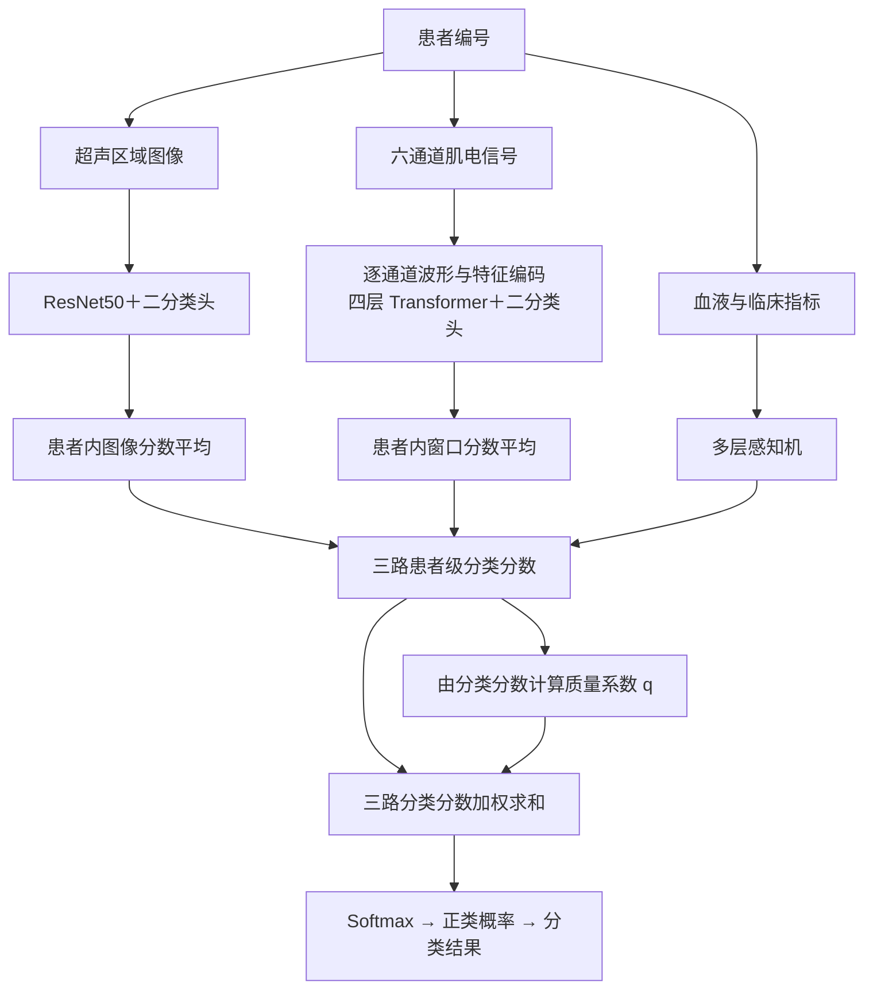
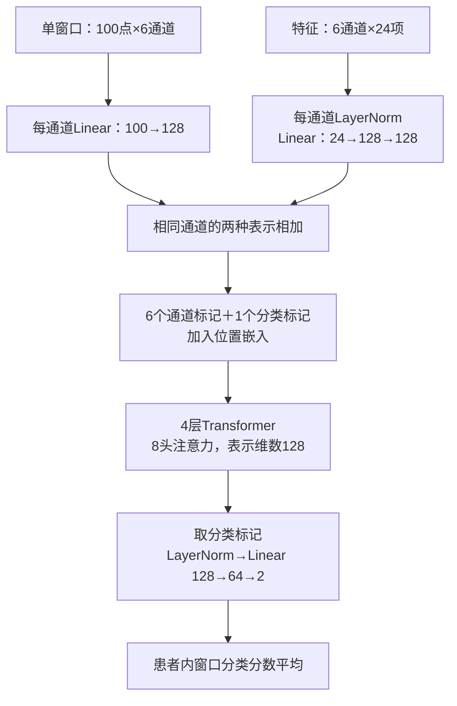
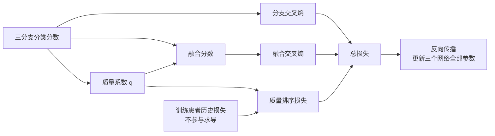

# 质量感知的三模态肌少症分类：从患者对齐到增强版 QMF

超声图像、肌电信号以及血液与临床指标分别描述患者的不同侧面。三路数据的形态、数量和质量并不一致：一名患者可以有多张超声图像，肌电记录会被切成大量窗口，而表格通常只有一行。这个方案先在每个分支内形成患者级分类分数，再利用质量感知动态融合得到最终预测。

当前主线是加入训练噪声增强的 QMF。三个网络共同训练，融合权重随患者变化。在85名患者的五折折外评估中，三种子集成取得 **85.88%的准确率、0.8850的受试者工作特征曲线下面积（AUC）和78.02%的平衡准确率**。相比此前版本，强超声噪声下的分类失效得到明显缓解。

本文按数据处理、网络、融合与训练、实验结果的顺序介绍。算法来源为 Zhang 等人的 *Provable Dynamic Fusion for Low-Quality Multimodal Data*（ICML 2023），原文保存在[参考论文](../references/zhang23ar.pdf)。

## 1. 整条路线：一名患者对应一个预测

最终队列包含85名患者，正类62名、负类23名。三路数据通过患者编号关联；同一患者的图像、肌电窗口和表格记录始终属于同一个训练或测试划分。



### 1.1 多张图像怎样与一份肌电、一行表格对应

对齐以患者为单位，不要求图像与肌电窗口一一配对。每次训练取同一患者的一张图像、一组窗口和一行指标，三路输出先统一为两个分类分数。

| 阶段 | 超声 | 肌电 | 表格 | 融合前汇总 |
| --- | --- | --- | --- | --- |
| 训练 | 随机抽1张图像 | 五段收缩各抽8窗，共40窗 | 当前患者的一行指标 | 图像直接输出；窗口分数平均；表格直接输出 |
| 验证、测试 | 使用全部图像 | 使用全部1,655窗 | 同一行指标 | 图像和窗口分别平均分类分数 |

例如，一名患者有8张图像，验证时会得到8组超声分类分数，将它们平均后只产生一组患者级超声分数。图像较多的患者不会因此变成更多独立测试样本。所有指标最终都按85名患者计算。

### 1.2 五折怎样划分

按患者标签进行分层五折划分，固定划分种子为20260911。每个外层测试折17人，剩余68人用于建模。三个训练种子42、43、44使用同一份五折名单；种子改变初始化和训练采样，不改变患者划分。

每折分两步：先用51人训练、17人验证，完整训练100轮，选出验证对数损失最低的轮数 E；然后合并这68人，从初始化重新训练 E 轮，最后预测外层17人。五折完成后，每名患者在每个种子下恰好获得一次未参与对应模型训练的预测，即折外预测。


肌电标准化、表格筛选与填补都只使用当次训练患者拟合。合并重训时，预处理参数重新由68名建模患者确定。测试患者不参与参数拟合或轮数选择。本文单分支指标来自联合训练模型内部的输出头，与融合结果使用同样的测试患者。

## 2. 三路数据如何进入网络

### 2.1 超声：保留比例，患者内汇总

使用超声感兴趣区域图像，每名患者2～14张。图像转为三通道，保持长宽比缩放到不超过224×224，居中补黑边；小图不额外放大。像素缩放至0～1后，使用ImageNet均值和标准差归一化。

基础训练增强包括50%概率水平翻转，以及0.92～1.08倍亮度和0.90～1.10倍对比度变化。新增噪声增强在后文单独说明。常规验证和测试关闭增强，使用全部图像，先平均分数再融合。

### 2.2 肌电：六通道波形和逐通道特征

肌电分支输入包括100毫秒波形以及每通道24项特征。处理步骤为：

1. 按通道审计清单统一六通道顺序，采样率为1,000 Hz。
2. 对原始记录采用三阶10～499 Hz Butterworth带通和50 Hz陷波，陷波品质因数为35，使用前后向滤波。
3. 提取50～60、70～80、90～100、110～120、130～140秒五段收缩，每段10秒。
4. 按100点窗长、30点步长切窗，每段331窗，共1,655窗。
5. 用训练患者拟合每个通道的均值和标准差，完成标准化。
6. 从标准化波形提取六通道共144维特征。

已滤波的特殊记录使用已有收缩标记并插值到每段10,000点；缺失通道按原通道审计方案补齐。当前保留的是原肌电分类网络对应的24项特征方案。

| 特征组 | 每通道数量 | 内容 |
| --- | ---: | --- |
| 时域 | 6 | 均方根、平均绝对值、绝对峰值、过零次数、波形长度、斜率符号变化次数 |
| 傅里叶频谱 | 9 | 五频带能量、频谱质心、峰值频率、中值频率、平均功率频率 |
| 短时傅里叶变换 | 5 | 五频带平均谱能量；窗长64、步长32、变换点数128 |
| 小波 | 4 | db4三级分解的四组系数能量 |

五个频带为0～50、50～100、100～200、200～400、400～500 Hz。频谱质心与平均功率频率沿用原实现，计算式相同但占两个特征位置。

### 2.3 表格：血液和临床指标共同输入

候选字段共95项，包括40项临床指标和55项血液指标，沿用v1.4字段清单。临床部分包括年龄、性别、体格测量、病程、合并疾病、活动能力和量表指标等。因此，文中统一称为“血液与临床指标”，不将这一分支简称为只含血液检查。

每次训练删除缺失比例超过50%的列和常数列，以训练集列中位数填补缺失，再进行训练集均值、标准差归一化。保留字段数记为 D，决定多层感知机的输入维数。完整候选字段见[指标清单](../data/feature_names.csv)。

## 3. 三个分支网络

### 3.1 超声：ResNet50

```text
3×224×224图像
→ ResNet50主干与全局平均池化
→ 2048维表示
→ Dropout(0.35)
→ Linear(2048, 2)
```

主干使用已下载的ImageNet权重初始化，新二分类头随机初始化。主干与分类头同时更新，共23,512,130个参数。每张图像输出两个未经Softmax的分类分数。

### 3.2 肌电：先编码通道，再学习通道关系



波形编码和特征映射在通道间共享参数，位置嵌入保留通道区别。Transformer前馈层维数256，Dropout为0.2，使用先归一化结构。人工特征在注意力层之前与波形表示相加，网络保留了逐通道特征映射分支。

网络参数量572,274，从随机初始化开始训练。注意力建模的是一个窗口内的通道关系；不同窗口最后通过分数平均汇总为患者级输出。

### 3.3 表格：小型多层感知机

```text
D维标准化指标
→ Linear(D,64) → LayerNorm → GELU → Dropout(0.2)
→ Linear(64,32) → GELU
→ Linear(32,2)
```

参数量为64D＋2338。以D=94为例，表格网络8,354个参数，三分支总计24,092,758个参数。表格分支随机初始化，三个分支均没有额外的任务级单独预训练阶段。

## 4. QMF怎样融合、怎样分类

### 4.1 从分类分数得到质量系数

记某名患者在模态 m 的两个分类分数为 zₘ,₀ 和 zₘ,₁，分别对应负类和正类。完成患者内汇总后，每个分支提供一组分数。QMF利用它们计算质量系数 qₘ：

$$
q_m=\frac{1}{10}\log\left(e^{z_{m,0}}+e^{z_{m,1}}\right).
$$

代码使用 `logsumexp` 稳定计算。此式与原仓库RGB-D实现一致；本项目把原来的两路加权扩展到三路。qₘ是动态融合系数，未经归一化，也不是概率。

### 4.2 加权求和，再转为概率

用 zₘ 表示该分支的二分类分数向量，融合分数为：

$$
z_{\mathrm{fused}}=\sum_{m\in\{\mathrm{US},\mathrm{EMG},\mathrm{Table}\}}q_mz_m.
$$

式中US、EMG、Table依次代表超声、肌电、表格。每个系数对同一路的两个类别分数同时加权。随后通过Softmax得到正类概率 p₁：

$$
p_1=\frac{\exp(z_{\mathrm{fused},1})}
{\exp(z_{\mathrm{fused},0})+\exp(z_{\mathrm{fused},1})}.
$$

固定阈值为0.5：正类概率不低于0.5时判为正类。三个种子的最终评估先对同一患者的概率取平均，再计算分类指标。

## 5. 损失与反向传播

### 5.1 融合输出和三个分支都接受监督

将融合输出的交叉熵记为 L融合，各分支交叉熵记为 Lₘ。训练使用按当次训练集类别数计算的类别权重，减轻62∶23类别分布不均衡的影响。

分类损失为：

$$
L_{\mathrm{cls}}=L_{\mathrm{fused}}+\sum_{m=1}^{3}L_m.
$$

四项系数均为1。分支监督让各网络直接学习分类，融合监督则根据最终预测联合调整三路输出。

### 5.2 当前排序项怎样约束 q

排序项希望历史分类损失较低的患者获得较高的质量分数。对模态 m，记患者 i 的历史累计未加权交叉熵为 hᵢ,ₘ。每个批次将患者与循环移位后的另一名患者 j 配对，定义排序方向 sᵢⱼ,ₘ和目标间隔 dᵢⱼ,ₘ：

$$
s_{ij,m}=\operatorname{sign}(h_{j,m}-h_{i,m}),\qquad
 d_{ij,m}=\frac{|h_{i,m}-h_{j,m}|}
 {\max(\max_k h_{k,m}-\min_k h_{k,m},\varepsilon)}.
$$

这里 ε 表示防止分母为零的数值保护；实现将分母下限设为10⁻¹²。若患者 i 的历史损失更低，s为正，就希望其q高于患者j。当前正间隔排序损失为：

$$
L_{\mathrm{rank}}=\sum_{m=1}^{3}\operatorname{mean}_{(i,j)}
\max\left(0,d_{ij,m}-s_{ij,m}(q_{i,m}-q_{j,m})\right).
$$

总损失为：

$$
L=L_{\mathrm{cls}}+0.1L_{\mathrm{rank}}.
$$

历史值先用于当前批次的排序，随后才加入该批次的新损失。历史累积不参与求导，验证和测试也不更新历史。当前正间隔公式是对原仓库排序实现的改动；另有原仓库排序及排序系数为零的完整对照实验。

### 5.3 梯度如何回到各网络

融合损失可以通过两条路径影响分支：直接经过加权分类分数，以及经过由分类分数计算出的q。令 g 为融合损失对融合分数的梯度，则模态 m 从融合项得到的梯度为：

$$
\frac{\partial L_{\mathrm{fused}}}{\partial z_m}
=q_m g+\frac{g^{\mathsf T}z_m}{10}\operatorname{softmax}(z_m).
$$

第一项来自直接加权，第二项来自质量系数的变化。再叠加该分支自身交叉熵和排序损失的梯度，最终更新ResNet50、肌电Transformer和表格多层感知机。q没有从计算图中分离，也没有另设一个门控网络。



## 6. 为什么加入训练噪声增强

原版在强超声噪声下出现异常：超声分支的分类分数变得很大，q也随之增大，使受损模态在融合中占据很大系数。最大测试强度下，原版超声平均q达到214.056，融合AUC降至0.5119。

增强版让模型在训练期间见到不同质量的输入，保持原有网络、能量权重和排序公式。每个患者每次被采样时，有50%概率不增加这类噪声；另50%概率等概率选取一种模态加噪，每次只扰动一路。

| 模态 | 训练噪声标准差 | 具体处理 |
| --- | --- | --- |
| 超声 | 从0～0.10均匀抽样，单位为0～1像素 | 三通道共享噪声，裁剪到0～1，再归一化 |
| 肌电 | 从0～1均匀抽样，单位为训练标准化尺度 | 连续片段加噪后切窗，重算144维特征 |
| 表格 | 从0～1均匀抽样，单位为训练标准化尺度 | 对填补、标准化后的保留指标加噪 |

肌电噪声先在连续10秒片段上生成，再按训练采样位置提取窗口，因此重叠部分共享同一噪声。波形与人工特征始终来自同一份受扰动信号。

常规验证保持干净输入，以干净验证损失选择轮数。增强版等权融合与增强版QMF使用相同训练设置，为比较动态融合提供直接对照。

## 7. 常规分类结果

### 7.1 主线结果

下表为85名患者的三种子集成结果。AUC表示受试者工作特征曲线下面积；平衡准确率为敏感度与特异度的平均值。

| 方法 | AUC | 准确率 | 平衡准确率 | 敏感度 | 特异度 | 对数损失↓ |
| --- | ---: | ---: | ---: | ---: | ---: | ---: |
| 原版等权融合 | 0.8541 | 82.35% | 72.86% | 93.55% | 52.17% | 0.4083 |
| 原版QMF | 0.8703 | 83.53% | 75.04% | 93.55% | 56.52% | 0.3766 |
| 增强版等权融合 | 0.8836 | 84.71% | 75.84% | 95.16% | 56.52% | 0.3683 |
| **增强版QMF** | **0.8850** | **85.88%** | **78.02%** | **95.16%** | **60.87%** | **0.3523** |

增强版QMF正确识别59名正类和14名负类，总计73人；原版QMF正确71人。错误包括3名正类漏判和9名负类误判。相比增强版等权融合，QMF多正确识别1名负类。

旧TMC的AUC为0.9004、准确率81.18%，反映出概率排序与固定阈值分类的不同侧重。它没有在本轮使用同样的噪声增强，因此作为历史方法对照保留，不混入本轮增强策略的直接比较。

### 7.2 结果有多稳定

增强版QMF在三个种子上的AUC为0.8866±0.0262，准确率为83.53%±1.18%，平衡准确率为75.49%±1.54%。这里的“±”是三个种子的样本标准差，不是患者置信区间；集成后的结果与种子均值也不是同一统计量。

配对置信区间以患者为独立单位，按类别分层、有放回重采样10,000次，各模型使用同一患者索引。

| 比较 | AUC差值 | 95%置信区间 |
| --- | ---: | --- |
| 增强QMF－原版QMF | +0.0147 | −0.0084～0.0407 |
| 增强QMF－增强等权 | +0.0014 | −0.0217～0.0210 |

增强QMF的点估计更高，AUC差异仍有不确定性。新版同时将选轮阶段从原来的早停设置改为完整100轮，因此新旧差异反映的是整体训练方案变化。本轮增强QMF与增强等权的训练条件一致，是主要比较对象。

### 7.3 三个分支各自表现如何

| 联合训练中的分支 | 原版QMF AUC | 增强版QMF AUC | 增强版准确率 |
| --- | ---: | ---: | ---: |
| 超声 | 0.6122 | 0.6339 | 71.76% |
| 肌电 | 0.4123 | 0.3899 | 65.88% |
| 表格 | 0.8969 | 0.8997 | 80.00% |
| 融合 | 0.8703 | 0.8850 | 85.88% |

表格是目前主要的区分信息来源。融合提高了固定0.5阈值下的准确率，但AUC仍略低于表格分支。肌电单分支较弱，这一版保持既有结构，暂不继续调整。这里的分支结果均来自联合模型内部输出头，不等同于独立训练的单模态基线。

## 8. 模态质量下降实验

### 8.1 如何保证各方法可比

读取已经训练好的模型，每次只扰动一路测试输入，另外两路保持原样。四个非零强度为0.25、0.5、1、2，另设无扰动强度0。超声实际像素噪声标准差为强度乘0.1；肌电和表格使用训练标准化单位。不同模态的数值强度不代表同一种物理损坏程度。

噪声根据患者、模态和重复编号固定，与方法或训练种子无关，各方法使用同一份扰动。同一噪声方向逐级放大，每档重复3次。每个噪声重复先集成三个模型种子，再计算指标，最后平均重复指标；不会把不同噪声预测先平均成另一个抗噪集成。

两种增强设置合计30个模型、22,950条预测。程序先核对无扰动预测与保存的折外结果一致，再进行受扰动推理。

### 8.2 强超声噪声下，分类失效明显缓解

| 超声强度 | 原版QMF AUC | 增强QMF AUC | 增强等权AUC |
| ---: | ---: | ---: | ---: |
| 0 | 0.8703 | 0.8850 | 0.8836 |
| 0.25 | 0.8787 | 0.8859 | 0.8843 |
| 0.5 | 0.8817 | 0.8827 | 0.8836 |
| 1 | 0.5477 | 0.8869 | 0.8866 |
| 2 | 0.5119 | 0.8871 | 0.8906 |

原版QMF在强度1、2时接近随机分类，增强版在整个测试范围内保持约0.885的AUC。增强等权也保持稳定，说明改善来自新训练方案与模型共同作用，不能只归因于动态加权。

### 8.3 表格受损时，QMF出现减轻下降的趋势

| 表格强度 | 增强QMF AUC | 增强等权AUC |
| ---: | ---: | ---: |
| 0 | 0.8850 | 0.8836 |
| 0.25 | 0.8857 | 0.8871 |
| 0.5 | 0.8780 | 0.8742 |
| 1 | 0.8427 | 0.8312 |
| 2 | 0.7756 | 0.7464 |

最大强度下，QMF的AUC下降0.1094，等权下降0.1372，前者少下降0.0278，配对95%区间约为0.0000～0.0570。下界贴近零，这一结果可描述为有利趋势。

肌电扰动下，增强QMF的AUC由0.8850变为最大强度下的0.8978，增强等权由0.8836变为0.9074。噪声没有造成融合性能单调下降；这一现象不能单独解释为模型能准确识别所有受损样本。

### 8.4 q是否随着质量变化

最大强度下，被扰动分支的平均响应如下：

| 模态 | q：无扰动→受扰动 | 分支损失：无扰动→受扰动 |
| --- | --- | --- |
| 超声 | 0.1816→0.0793 | 0.7061→0.6864 |
| 肌电 | 0.1411→0.1063 | 0.7185→1.0210 |
| 表格 | 0.3848→0.3267 | 0.6058→0.9276 |

三个模态的平均q随扰动强度增加而下降，最大强度下降的患者级区间均不包含零。肌电和表格在强扰动下出现损失上升、q下降，符合质量感知的预期方向。超声损失没有明显上升，主要体现为分数稳定与系数下降，不再出现原版的极端放大。

干净测试数据上，增强版超声、肌电和表格的折内q–loss Spearman中位数分别为−0.556、−0.380、−0.885，表格的排序关系最强。相关系数按各折独立计算，避免混合不同模型的输出尺度。

### 8.5 这一组实验说明什么

最明确的结论是：增强版缓解了此前强超声噪声下的失效，q的平均响应也更符合降权预期。相对于同样增强的等权模型，QMF的优势依赖模态和指标。超声、肌电扰动下AUC变化差值的区间包含零；超声强度0.5时，QMF的平衡准确率变化还比等权差约4.06个百分点。

这些结果支持报告当前方案在所测合成扰动下的稳定性，同时将表格强扰动下的动态融合优势表述为趋势。实验没有覆盖全部真实采集故障，也没有消除原能量函数对logit尺度的结构敏感性。

## 9. 原QMF哪些保留、哪些适配

| 部分 | 原仓库RGB-D实现 | 当前主线 |
| --- | --- | --- |
| 输入 | 彩色图像与深度图像 | 超声、肌电、血液与临床指标 |
| 编码器 | 原任务双分支编码器 | ResNet50、六通道Transformer、多层感知机 |
| 样本单位 | 原任务样本 | 患者，内部图像和窗口先汇总 |
| 质量系数 | logsumexp分类分数除以10 | 保留同一计算式 |
| 融合 | 两路分类分数动态加权相加 | 扩展为三路相加 |
| 分类监督 | 融合与分支监督 | 保留，加入训练集类别权重 |
| 排序 | 原仓库历史损失排序计算 | 当前正间隔排序；原公式另做消融 |
| 训练 | 原任务训练协议 | 患者级选轮与合并重训、训练噪声增强 |

这些适配让不同数量、不同形态的数据能够以患者为单位进入同一融合过程。本文采用QMF的核心动态加权机制，对网络接口、数据聚合和训练策略作了场景适配。

此前未增强的排序消融中，无排序、当前排序、原仓库排序的AUC分别为0.8801、0.8703、0.8640。消融没有显示排序项必然提升AUC；本轮也未重新完成增强条件下的全部排序消融。因此，当前主线以整体方案效果为重点，不单独宣称正间隔排序普遍优于原公式。

## 10. 汇报时如何概括

可以用下面这段话收束方法与结果：

> 本研究构建了质量感知的三模态肌少症分类框架，联合利用超声图像、肌电信号及血液与临床指标。三个分支在患者级分类监督下共同优化，通过动态质量系数融合分类分数，并在训练中引入单模态噪声增强。在本队列的五折折外评估中，框架取得85.88%的准确率和0.8850的AUC；在测试的超声噪声范围内保持了较稳定的分类表现，表格强扰动下呈现减轻性能下降的趋势。

这条主线的重点是场景适配、患者级融合和增强后的表现。已有测试结果用于提出本次改进，因此新版本属于同队列上的探索性迭代；后续独立队列可进一步检验泛化。当前汇报无需把证明原论文理论作为目标。

## 附录A：完整训练与评估参数

| 项目 | 当前主线设置 |
| --- | --- |
| 实验名称 | noise_aug_v1 |
| 患者与分布 | 85人，正类62、负类23 |
| 外层划分 | 分层五折；固定种子20260911；每折测试17人 |
| 选轮数据 | 51人训练、17人验证 |
| 选轮轮数 | 100轮；patience=100，不提前停止 |
| 选轮指标 | 干净验证集对数损失最小 |
| 最终训练 | 合并68人，重新初始化，训练选定E轮 |
| 训练种子 | 42、43、44；各折内部初始化种子为训练种子加折号 |
| 优化器 | AdamW，betas=(0.9,0.999)，eps=1e-8 |
| 超声主干学习率 | 1e-5 |
| 超声头、肌电、表格学习率 | 2e-4 |
| 学习率调度 | 无 |
| 权重衰减 | 1e-3 |
| 梯度裁剪 | 总梯度范数上限5 |
| 批量大小 | 6名患者，不丢弃末批 |
| 数据加载 | num_workers=0；GPU时启用pin_memory |
| CPU线程数 | 2 |
| 超声训练输入 | 每患者1张224×224图像 |
| 超声初始化 | ImageNet ResNet50权重，分类头随机初始化 |
| 超声分类头 | Dropout 0.35，2048→2 |
| 肌电输入 | 六通道、100点窗口、144维特征 |
| 肌电训练采样 | 每段8窗，五段共40窗 |
| 肌电验证与测试 | 全部1,655窗，推理批量上限256窗 |
| 肌电网络 | d_token=128，8头，4层，前馈256，Dropout 0.2 |
| 肌电初始化 | 随机初始化 |
| 表格网络 | D→64→32→2，首隐层LayerNorm、Dropout 0.2 |
| 表格初始化 | 随机初始化 |
| 训练参数范围 | 三个网络全部参数联合更新 |
| 类别权重 | 当次训练人数除以对应类别人数的2倍 |
| 分类损失系数 | 融合与三路分支各1 |
| 排序模式与系数 | positive_margin，0.1 |
| 质量缩放 | logsumexp除以10 |
| 噪声选择概率 | 每患者50%概率随机扰动一路，三路等概率 |
| 训练噪声上限 | 超声像素标准差0.1；肌电与表格标准化标准差1 |
| 分类阈值 | 0.5 |
| 种子集成 | 对同一患者的正类概率求均值 |
| 测试噪声强度 | 0、0.25、0.5、1、2；每档3次重复 |
| 置信区间 | 患者级按类别分层配对Bootstrap，10,000次 |
| 测试环境 | Python3.11、PyTorch2.4.0、CUDA12.4；RTX3060 Laptop GPU |

实际最终模型参数、每轮训练记录、验证选轮结果和预处理字段均保存在相应实验折目录中。

## 附录B：PPT可以按12页组织

| 页 | 标题 | 主要内容 |
| ---: | --- | --- |
| 1 | 研究目标与当前结果 | 三模态联合分类，85.88%准确率、0.8850 AUC |
| 2 | 患者对齐与五折划分 | 85名患者，训练抽样与评估聚合，使用第1节流程图 |
| 3 | 三路数据处理 | 超声区域、六通道切窗、表格训练集预处理 |
| 4 | 三个分支网络 | ResNet50、逐通道Transformer、多层感知机 |
| 5 | 动态质量融合 | q的来源、分类分数加权、Softmax输出 |
| 6 | 损失与联合训练 | 分支监督、融合监督、排序项及反向传播 |
| 7 | 为什么加噪声增强 | 原版强超声噪声失效、单模态随机增强设计 |
| 8 | 常规分类表现 | 第7.1节结果表和73/85正确分类 |
| 9 | 三分支与排序对照 | 内部分支结果，原版排序消融，解释信息来源 |
| 10 | 扰动下的分类表现 | 超声失效缓解、表格强扰动趋势 |
| 11 | q是否感知质量变化 | 第8.4节q和损失变化表 |
| 12 | 结论与后续工作 | 当前适配价值、等权对照、独立验证方向 |

## 附录C：数据与结果入口

- [主线QMF指标](../artifacts/runs/noise_aug_v1/qmf/summary.json)
- [增强等权指标](../artifacts/runs/noise_aug_v1/equal_late/summary.json)
- [主线扰动评估](../reports/qmf_robustness_noise_aug_v1/report.md)
- [原版扰动评估](../reports/qmf_robustness/report.md)
- [原版质量与尺度分析](../reports/qmf_diagnostics/report.md)
- [原版排序补充汇报](QMF三模态融合补充分析汇报.md)
- [独立目录运行说明](../README.md)
- [结果总索引](结果索引.md)
