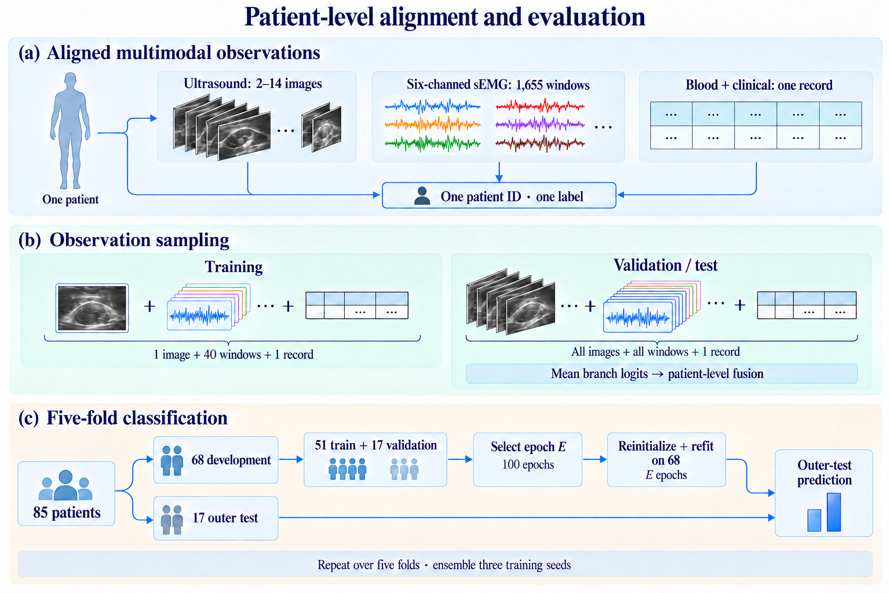
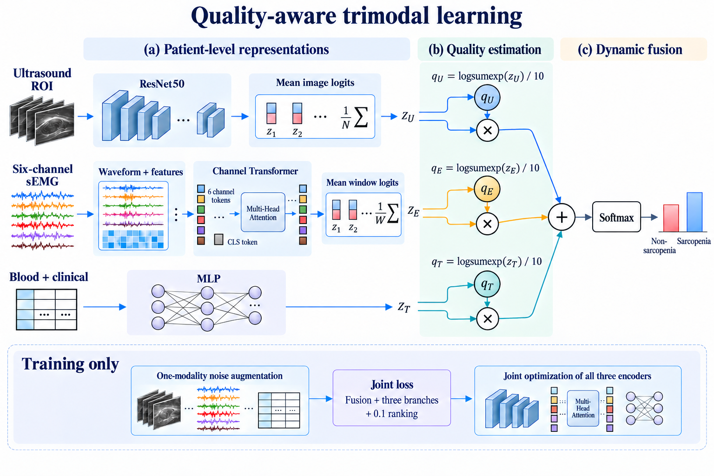
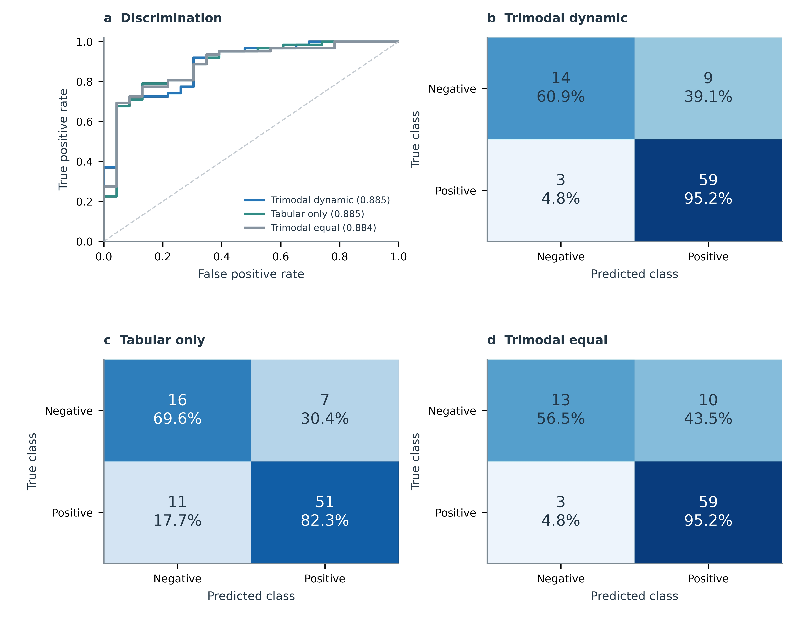
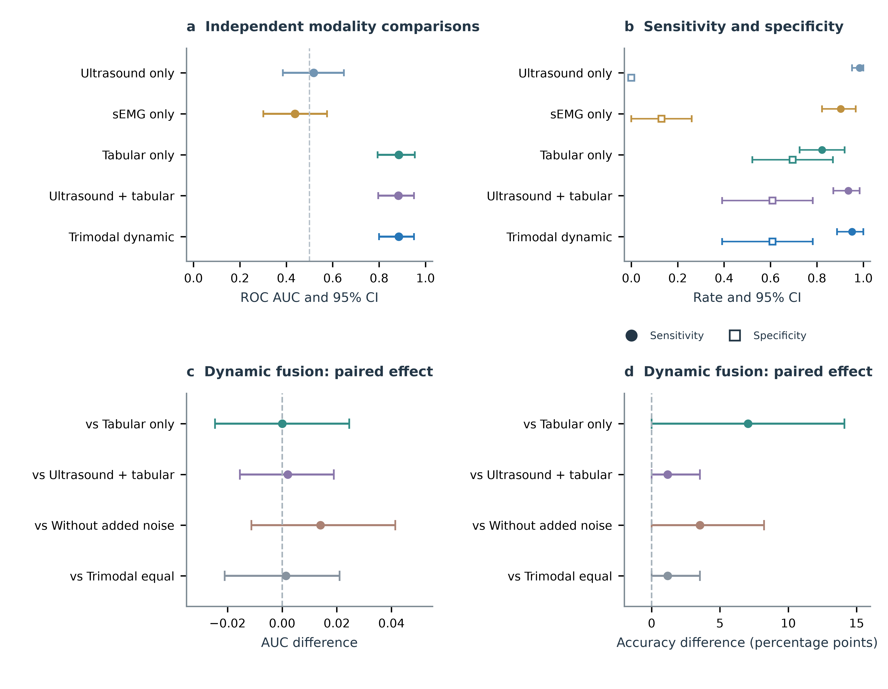
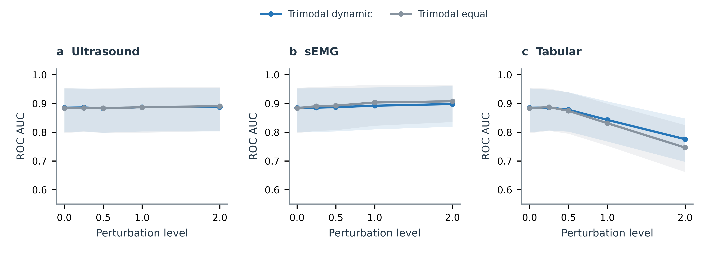

# Quality-aware fusion of ultrasound, surface electromyography, and clinical indicators for sarcopenia classification

## Abstract

Ultrasound, surface electromyography, and clinical measurements describe different aspects of muscle status, but their integration requires alignment of unequal observation counts and accommodation of variable input quality. We present a quality-aware framework for patient-level sarcopenia classification. A residual network encodes ultrasound regions, a channel Transformer processes six-channel electromyographic waveforms and features, and a multilayer perceptron encodes blood and clinical indicators. Image and signal logits are averaged within each patient and combined through differentiable quality coefficients. Joint classification and historical-loss ranking train the three branches, with single-modality noise augmentation. In 85 patients, five-fold classifier evaluation using fixed ultrasound regions and three-seed ensembling achieved an area under the receiver operating characteristic curve (AUC) of 0.8850, accuracy of 85.88%, sensitivity of 95.16%, and specificity of 60.87%. An independently trained tabular model achieved the same AUC, with 78.82% accuracy and 82.26% sensitivity. Removing electromyography yielded an AUC of 0.8829 and 84.71% accuracy. Quality–loss rank correlations were negative across the three modalities. Under strong tabular perturbation, dynamic fusion achieved an AUC of 0.7756, compared with 0.7464 for matched equal-weight fusion. These results characterize a high-sensitivity multimodal operating point and modality-dependent responses to degraded inputs.

**Keywords:** Sarcopenia; Multimodal learning; Dynamic fusion; Ultrasound; Surface electromyography; Robust classification

## 1. Introduction

Sarcopenia involves changes in muscle structure and function that are difficult to characterize with a single measurement. In stroke rehabilitation, neurological injury, reduced activity, and nutritional disturbances can affect these dimensions simultaneously (Chon et al., 2024). Integrating measurements of local muscle morphology, neuromuscular activity, and systemic status offers a useful basis for automated classification. The computational task is to combine these complementary observations into one patient-level decision.

Ultrasound, surface electromyography (sEMG), and blood and clinical indicators provide three distinct descriptions of muscle status. Ultrasound captures tissue appearance and regional morphology, sEMG records electrical activity during muscle activation, and structured indicators describe systemic and functional conditions. Previous studies have examined ultrasound for stroke-related sarcopenia assessment (Park et al., 2022), associations between ultrasound measurements and muscle strength (Yuan & Kim, 2024), and sEMG-based machine learning for sarcopenia classification (Li et al., 2024; Kumar et al., 2024). Recent synthesis of sEMG studies identifies substantial variation in acquisition tasks and signal processing, making the recording protocol central to model interpretation (Leone et al., 2025). More broadly, medical classification systems have combined signal-derived images with patient history (Yu et al., 2023), imaging with clinical records (Dusari & Challa, 2025), and multiple molecular data sources (Wang, 2025). These studies motivate a multimodal approach that preserves the information specific to each input. Combining imaging with clinical context is also a central theme in biomedical artificial intelligence and medical data-fusion research (Huang et al., 2020; Acosta et al., 2022).

Two challenges arise when applying this approach to sarcopenia. The first is the unequal number and structure of observations. A patient can contribute several ultrasound views, thousands of overlapping sEMG windows, and one clinical record. Directly treating these observations as separate samples would assign different importance to patients according to their recording volume. A shared patient-level representation is therefore needed before the modalities can be combined.

The second challenge is variation in modality reliability. Image quality, muscle activation patterns, and the informativeness of clinical indicators vary across patients. A fixed fusion rule gives each branch the same nominal role regardless of these differences. Dynamic fusion provides a way to adjust the contribution of each branch. In particular, the analysis of Zhang et al. (2023) motivates learning fusion coefficients that associate higher quality with lower modality-specific prediction loss. Implementing this principle across image, signal, and tabular encoders requires joint optimization and direct assessment of how the coefficients behave under degraded inputs.

We introduce a quality-aware trimodal framework that addresses these challenges through patient-level aggregation and joint learning. ResNet50 encodes ultrasound regions, a channel Transformer combines sEMG waveforms and handcrafted features, and a multilayer perceptron processes blood and clinical indicators. The image and signal branches average their observation-level logits within each patient. Quality coefficients computed from the resulting branch outputs then determine the fused decision. Branch supervision and a history-based ranking objective train the encoders together, while random single-modality noise augmentation exposes the model to variations in input quality.

The main contributions are:

- A patient-level formulation that aligns multiple ultrasound images and sEMG windows with a single clinical record and produces one classification per patient.
- A joint learning framework that combines modality-specific encoding, quality-aware decision fusion, and single-modality noise augmentation for sarcopenia classification.
- An evaluation combining independently trained single-modality models, modality and augmentation ablations, patient-level uncertainty, quality–loss associations, and controlled input perturbations.

Section 2 presents the methodology. Section 3 evaluates four questions concerning classification, component behavior, quality estimation, and robustness. Section 4 positions the method within related work, followed by discussion and conclusions in Sections 5 and 6.

## 2. Methodology

### 2.1. Problem formulation and framework overview

The patient is the unit of learning and prediction (Fig. 1). For patient i, the inputs comprise an ultrasound image set Uᵢ, an sEMG window set Eᵢ, and a tabular vector tᵢ. The corresponding binary label yᵢ equals one for sarcopenia and zero otherwise. The objective is to estimate a single sarcopenia probability from these three inputs.

**Fig. 1.** Patient-level data organization and classification evaluation. (a) Patient identifiers align ultrasound images, sEMG windows, and structured indicators. (b) Training samples observations from each patient; evaluation aggregates all available observations. (c) Each outer fold uses 51 patients for training and 17 for validation to select epoch E, followed by reinitialization and refitting on 68 patients. The remaining 17 patients form the outer test set. The procedure is repeated across five folds and three training seeds. Input images and signals are schematic. Created with OpenAI’s image-generation tool.

Fig. 2 presents the framework. Each encoder produces two-class logits. The image and signal branches aggregate these logits within the patient, while the tabular branch directly generates a patient-level output. Let fᵤ, fₑ, and fₜ denote the three branch predictors, Nᵢ the number of images, and Wᵢ the number of windows. The patient-level logits are

$$
\mathbf z_i^{u}=\frac{1}{N_i}\sum_{n=1}^{N_i}f_u(\mathbf u_{i,n}),\qquad
\mathbf z_i^{e}=\frac{1}{W_i}\sum_{w=1}^{W_i}f_e(\mathbf x_{i,w},\boldsymbol\phi_{i,w}),\qquad
\mathbf z_i^{t}=f_t(\mathbf t_i),
\tag{1}
$$

where xᵢ,𝑤 is an sEMG waveform window and φᵢ,𝑤 contains its handcrafted features. During training, the averages use sampled observations; evaluation uses all available observations. Quality coefficients computed from these logits determine their contribution to the fused prediction.

**Fig. 2.** Overview of the quality-aware trimodal framework. Ultrasound images and sEMG windows are encoded separately and aggregated into patient-level logits. Blood and clinical indicators are processed by a multilayer perceptron. Each branch produces a quality coefficient that scales its own logits before summation and softmax classification. The lower panel summarizes the training strategy. Input images and signals are schematic illustrations. Created with OpenAI’s image-generation tool.

### 2.2. Input preprocessing

#### 2.2.1. Ultrasound region extraction

An existing U-Net pipeline generates muscle region annotations. The network has four encoder–decoder levels with 32, 64, 128, and 256 channels and a 512-channel bottleneck. At inference, grayscale images are replicated across three channels, resized to 256 × 256, and normalized. Probability maps from five previously trained segmentation models are averaged, resized to the original image dimensions, and thresholded at 0.5. The largest connected region is retained, followed by contour filling and morphological closing.

The classification pipeline crops the bounding box of the resulting polygon with a 15% context margin. Each crop is resized while preserving its aspect ratio and centered on a 224 × 224 black canvas. ImageNet normalization is then applied. Training additionally uses horizontal flipping with probability 0.5, brightness scaling in [0.92, 1.08], and contrast scaling in [0.90, 1.10]. One image is sampled per patient during training; all images are used for validation and testing. The segmentation models remain fixed during classifier training. They were developed using patients from the same cohort, with a partly different image collection. The five-model ensemble used for region extraction was not nested within the classification folds; the reported cross-validation therefore evaluates the classifier conditional on these fixed regions.

#### 2.2.2. Surface electromyography

Six-channel sEMG is sampled at 1,000 Hz. After channel alignment, raw recordings are processed using a third-order Butterworth bandpass filter at 10–499 Hz and a 50 Hz notch filter with a quality factor of 35. Both filters use forward–backward application. Five 10 s contraction intervals are extracted at 50–60, 70–80, 90–100, 110–120, and 130–140 s. A 100-sample window with a 30-sample stride yields 331 windows per interval and 1,655 windows per patient.

Channel-wise standardization parameters are estimated from training patients. Each standardized window is represented by a 100 × 6 waveform matrix and a 6 × 24 feature matrix. The features include six time-domain descriptors, nine Fourier-spectrum descriptors, five short-time Fourier descriptors, and four wavelet-energy descriptors. Their definitions and exceptional-record handling are provided in Supplementary Section S1.

Training samples eight windows from each contraction interval, giving 40 windows per patient. Evaluation uses all 1,655 windows, averaging logits within intervals and then across the five intervals. Because the intervals contain equal numbers of windows, this is equivalent to the window average in Eq. (1).

#### 2.2.3. Blood and clinical indicators

The tabular input contains 95 candidate fields: 55 blood indicators and 40 clinical indicators. Fields with more than 50% missing values and constant fields are removed using the current training set. Remaining missing values are replaced by training-set medians, and each retained field is standardized using its training-set mean and standard deviation. The retained dimension D determines the tabular network input. The fitted preprocessing is reused for validation and testing. The complete candidate-field inventory is provided in Supplementary Data S1. Fig. S1 summarizes the preprocessing workflow.

### 2.3. Modality-specific encoders

#### 2.3.1. Ultrasound encoder

The ultrasound encoder uses ResNet50 with ImageNet initialization (He et al., 2016). Global average pooling produces a 2,048-dimensional representation, followed by dropout with probability 0.35 and a linear two-class head. The new head is randomly initialized. Both the backbone and the head are updated during joint training. This branch contains 23,512,130 trainable parameters.

#### 2.3.2. Channel Transformer for sEMG

The sEMG encoder combines local waveform information with feature summaries before modeling channel interactions (Fig. S4). For channel c, a shared linear map projects its 100-sample waveform to 128 dimensions. A separate shared feature mapping applies layer normalization and a 24 → 128 → 128 multilayer perceptron to the handcrafted feature vector. The two representations are added channel-wise:

$$
\mathbf h_{i,w,c}=g_{\mathrm{wave}}(\mathbf x_{i,w,c})+
 g_{\mathrm{feat}}(\boldsymbol\phi_{i,w,c}),\qquad c=1,\ldots,6.
\tag{2}
$$

A learnable classification token and positional embeddings are added to the six channel tokens. Four Transformer encoder layers process the resulting sequence. Each layer uses eight attention heads, a token dimension of 128, a feedforward dimension of 256, pre-normalization, and dropout of 0.2. The classification-token representation is passed through layer normalization and a 128 → 64 → 2 head to produce window logits. Attention therefore models relationships among channels within a window; patient-level aggregation occurs afterward. The branch contains 572,274 parameters and is randomly initialized.

#### 2.3.3. Tabular encoder

The tabular branch is a randomly initialized D → 64 → 32 → 2 multilayer perceptron. The first hidden layer uses layer normalization, GELU activation, and dropout of 0.2; the second uses GELU. Its parameter count is 64D + 2,338. With D = 94, the complete three-branch classifier contains 24,092,758 parameters. All branches are jointly trained without a separate task-specific pretraining stage.

### 2.4. Quality-aware decision fusion

For patient i and modality m, let zᵢ,ₘ,₀ and zᵢ,ₘ,₁ denote the two components of the patient-level logit vector. Following the energy-based quality construction of Zhang et al. (2023), the quality coefficient is computed as

$$
q_{i,m}=\frac{1}{10}\log\left[\exp(z_{i,m,0})+\exp(z_{i,m,1})\right].
\tag{3}
$$

The implementation uses a numerically stable log-sum-exp operation. These coefficients depend on logit scale and can take negative values; their observed distributions are reported in Supplementary Section S4. The coefficients scale their corresponding logit vectors directly; no cross-modal normalization is applied. The fused logits and class probabilities are

$$
\mathbf z_i^{f}=\sum_{m\in\{u,e,t\}}q_{i,m}\mathbf z_i^m,
\qquad
\mathbf p_i=\operatorname{softmax}(\mathbf z_i^{f}).
\tag{4}
$$

The sarcopenia probability is the second component of pᵢ. A probability of at least 0.5 gives a positive classification. The coefficient qᵢ,ₘ controls the contribution of modality m. Section 3.4 examines its association with branch loss and its response to input perturbations.

### 2.5. Joint classification and quality ranking

The training objective supervises both the fused prediction and the individual branches. Denote their class-weighted cross-entropy losses by Lf and Lₘ, respectively. The complete objective is

$$
L=L_f+\sum_{m\in\{u,e,t\}}L_m+\lambda_rL_{\mathrm{rank}},
\qquad \lambda_r=0.1.
\tag{5}
$$

Each classification term has unit weight. For class c, the class weight is n/(2n꜀), where n is the number of training patients and n꜀ is the corresponding class count.

The ranking term encourages larger coefficients for patients with lower historical branch losses. Let hᵢ,ₘ be the cumulative, unweighted cross-entropy for training patient i in modality m. Within a batch, patient i is paired with patient j using a cyclic shift. The ordering sign and normalized margin are

$$
s_{ij,m}=\operatorname{sign}(h_{j,m}-h_{i,m}),\qquad
 d_{ij,m}=\frac{|h_{i,m}-h_{j,m}|}
 {\max\{\max_k h_{k,m}-\min_k h_{k,m},10^{-12}\}},
\tag{6}
$$

where k ranges over the training patients. We use a positive-margin ranking objective:

$$
L_{\mathrm{rank}}=\sum_{m\in\{u,e,t\}}
\frac{1}{|\mathcal P|}\sum_{(i,j)\in\mathcal P}
\max\{0,d_{ij,m}-s_{ij,m}(q_{i,m}-q_{j,m})\},
\tag{7}
$$

where P is the set of batch pairs. When patient i has a lower historical loss, Eq. (7) encourages qᵢ,ₘ to exceed qⱼ,ₘ. Supplementary Section S3 reports comparisons with the original ranking implementation and removal of the ranking term. Historical losses are read before the current batch is added and are detached from the computation graph. Validation and testing do not update this history.

The quality coefficients remain differentiable, so fused-classification gradients reach each encoder through both its logits and its coefficient. Branch-classification and ranking gradients are added in the same backward pass. Supplementary Section S8 gives the gradient expression and optimization diagram.

### 2.6. Single-modality noise augmentation

For each sampled patient, additional Gaussian noise is applied with probability 0.5. One of the three modalities is selected uniformly, and the other two remain unchanged. Ultrasound noise has a standard deviation sampled uniformly from [0, 0.10] in the [0, 1] pixel domain. The same noise is applied to all three image channels, followed by clipping and normalization.

For sEMG and tabular data, the noise standard deviation is sampled from [0, 1] in training-standardized units. sEMG noise is generated on continuous contraction intervals before window extraction; features are recomputed from the perturbed waveform. Overlapping windows consequently share the same noise realization. Tabular noise is added after imputation and standardization. Routine validation uses unperturbed inputs so that epoch selection reflects the original classification task.

**Algorithm 1. Joint training and patient-level inference**

**Inputs:** aligned patient records, training-fitted preprocessing, three branch predictors, and ranking coefficient 0.1. **Output:** a sarcopenia probability for each patient.

| Step | Operation |
|---|---|
| 1 | Initialize ResNet50 from ImageNet weights; randomly initialize its new head and the sEMG and tabular branches. Initialize training-loss histories. |
| 2 | Form a patient batch. For each patient, sample one image and eight windows from each of the five contraction intervals. |
| 3 | With probability 0.5, perturb one uniformly selected modality. Recompute sEMG features when its waveform is perturbed. |
| 4 | Encode the three inputs and aggregate observation logits into three patient-level vectors using Eq. (1). |
| 5 | Compute quality coefficients and fused probabilities using Eqs. (3)–(4). |
| 6 | Compute fused and branch cross-entropies. Read the previous training-loss histories to construct ranking targets, then add the current detached branch losses to the histories. |
| 7 | Combine losses using Eq. (5), backpropagate once, clip the gradient norm at five, and update all three branches with AdamW. Repeat for the prescribed training epochs. |
| 8 | At inference, aggregate all images and all sEMG windows before fusion. Average patient probabilities across training seeds and apply the 0.5 threshold. |

## 3. Experiments

The experiments address four questions:

- **Q1:** How does patient-level classification compare with single-modality models and equal-weight fusion?
- **Q2:** What changes when sEMG or noise augmentation is removed?
- **Q3:** How are the learned quality coefficients related to branch prediction loss?
- **Q4:** How does classification change when one modality is progressively perturbed?

### 3.1. Experimental settings

#### 3.1.1. Cohort and evaluation protocol

The cohort contains 85 patients, including 62 with sarcopenia and 23 without sarcopenia. Patients were recruited at [HOSPITAL] during [RECRUITMENT DATES]. Each patient has 2–14 ultrasound region images, six-channel sEMG, and a structured clinical record. We use stratified five-fold classification splits with a fixed splitting seed of 20260911. All observations from a patient remain together.

Each outer fold holds out 17 patients for testing. The remaining 68 patients are initially divided into 51 training and 17 validation patients. The model is trained for 100 epochs, and the epoch with the lowest validation log loss is selected. Denoting this epoch by E, the classifier is then reinitialized and trained on all 68 development patients for E epochs before predicting the outer test fold. Statistical preprocessing is refitted on the 68 patients during this refitting stage.

The five outer test folds yield one out-of-fold prediction per patient and training seed. We repeat training with seeds 42, 43, and 44 while keeping the patient splits unchanged. The primary results average each patient's positive-class probabilities across these three seeds. Individual-seed results are reported in Supplementary Section S6. The upstream segmentation ensemble is fixed throughout classification training.

#### 3.1.2. Implementation details

We optimize all three classification branches with AdamW (Loshchilov & Hutter, 2019). The learning rate is 10⁻⁵ for the ResNet50 backbone and 2 × 10⁻⁴ for the remaining parameters. Weight decay is 10⁻³, the patient batch size is six, and the gradient norm is clipped at five. No learning-rate scheduler is used. Table 1 lists the principal settings; the full configuration is provided in Supplementary Section S2.

**Table 1**  
Principal implementation settings.

| Component | Setting |
|---|---|
| Ultrasound input and backbone | 224 × 224; ImageNet-initialized ResNet50 |
| Ultrasound classification head | Dropout 0.35; 2048 → 2 |
| sEMG input | 100 × 6 waveform and 6 × 24 features per window |
| Channel Transformer | 4 layers; 8 heads; token width 128; feedforward width 256 |
| Transformer dropout | 0.2 |
| Tabular encoder | D → 64 → 32 → 2; dropout 0.2 |
| Optimizer | AdamW; weight decay 10⁻³ |
| Learning rates | Backbone: 10⁻⁵; other parameters: 2 × 10⁻⁴ |
| Batch size and gradient clipping | 6 patients; maximum gradient norm 5 |
| Quality coefficient | Log-sum-exp of branch logits divided by 10 |
| Ranking coefficient | 0.1 |
| Noise augmentation | Probability 0.5; one uniformly selected modality |
| Epoch selection | 100 epochs; minimum validation log loss |
| Refitting duration | Selected epoch E |
| Training seeds | 42, 43, 44 |

The main dynamic and equal-weight models were trained using Python 3.11, PyTorch 2.4.0, and CUDA 12.4 on an NVIDIA RTX 3060 Laptop GPU. The five additional single-modality and ablation experiments used PyTorch 2.4.0 with CUDA 12.1 on an NVIDIA A800; patient splits and training configurations were preserved. The three classification branches were optimized jointly; the upstream U-Net weights were fixed.

#### 3.1.3. Compared methods and ablations

We compare seven models using identical patient folds and three training seeds. Three single-modality models independently train the ultrasound, sEMG, or tabular encoder with one class-weighted cross-entropy objective. The two-modality model retains ultrasound and tabular inputs and applies the same quality fusion and ranking to its active branches. The trimodal equal-weight model averages the three patient-level logit vectors and uses fused and branch supervision. The full dynamic model uses Eqs. (3)–(7). Finally, the no-noise ablation removes added Gaussian noise from the full model while retaining routine image augmentation.

All models use the same 100-epoch selection and refitting procedure. For modality ablations, noise selection retains the original three-modality sampling space; selecting an inactive modality leaves the input unchanged. Each active modality consequently retains its original perturbation probability of 1/6. Independent single-modality training distinguishes encoder performance from the internal heads of a joint model. The dynamic-versus-equal comparison evaluates the complete fusion configurations, including ranking supervision in the dynamic model. Historical TMC and ranking comparisons are reported separately in Supplementary Section S3.

#### 3.1.4. Metrics and statistical analysis

We report the area under the receiver operating characteristic curve (AUC), accuracy, sensitivity, specificity, balanced accuracy, and log loss. The classification threshold is fixed at 0.5. Brier score and precision–recall area provide additional descriptions of probabilistic performance.

Confidence intervals are obtained using 10,000 stratified patient bootstrap samples (Efron, 1979). Each resample preserves the original class counts. Paired method comparisons use the same sampled patients for both models, and percentile intervals summarize the differences. Intervals describe patient variability conditional on the fitted models. The reporting separates model development, held-out prediction, and uncertainty estimation in line with the distinctions emphasized by TRIPOD+AI (Collins et al., 2024). Variation across the three training seeds is described using the sample standard deviation.

Quality–loss associations are evaluated separately within each seed–fold model. Pearson and Spearman correlations relate the quality coefficient to the corresponding unweighted branch cross-entropy on the 17 test patients. The resulting 15 correlations per modality summarize the association across the fitted models. Supplementary scale analyses use the median coefficient, common logit offset, and absolute class-logit gap within each model.

#### 3.1.5. Controlled input perturbation

We evaluate trained models at perturbation levels 0, 0.25, 0.5, 1, and 2. Only one modality is perturbed at a time. The ultrasound noise standard deviation is 0.1 times the level in pixel units; sEMG and tabular noise use the level in training-standardized units. Perturbation strength is defined separately in the pixel and standardized signal domains.

Each condition has three noise realizations. Noise is matched by patient, modality, and realization across methods and training seeds. Within each realization, the three model-seed probabilities are averaged before metric calculation. The final estimate averages the three realization-specific metrics. Patient bootstrap indices are shared across methods and conditions. Clean predictions are checked against the saved out-of-fold predictions before perturbed inference. The highest perturbation level exceeds the maximum training noise amplitude while retaining the same noise family. Perturbation comparisons are exploratory, with no multiplicity adjustment.

### 3.2. Patient-level classification (Q1)

Dynamic fusion correctly classified 73 of 85 patients, with an AUC of 0.8850 (95% CI 0.8001–0.9509) and accuracy of 85.88% (95% CI 78.82–91.76%). It identified 59 of 62 positive patients and 14 of 23 negative patients, yielding 95.16% sensitivity and 60.87% specificity. Table 2 compares the independently trained models and ablations using the same patient folds.

**Table 2**  
Patient-level performance from three-seed probability ensembles. Confidence intervals use 10,000 stratified patient bootstrap resamples; the classification threshold is 0.5.

| Model | AUC (95% CI) | Accuracy (%) | Sensitivity (%) | Specificity (%) | Balanced accuracy (%) |
|---|---:|---:|---:|---:|---:|
| Ultrasound only | 0.5182 (0.3857–0.6480) | 71.76 | 98.39 | 0.00 | 49.19 |
| sEMG only | 0.4376 (0.3015–0.5758) | 69.41 | 90.32 | 13.04 | 51.68 |
| Blood and clinical only | 0.8850 (0.7938–0.9544) | 78.82 | 82.26 | 69.57 | 75.91 |
| Ultrasound + blood and clinical | 0.8829 (0.7959–0.9509) | 84.71 | 93.55 | 60.87 | 77.21 |
| Trimodal equal-weight fusion | 0.8836 (0.7945–0.9530) | 84.71 | 95.16 | 56.52 | 75.84 |
| Trimodal dynamic, no noise augmentation | 0.8710 (0.7875–0.9383) | 82.35 | 93.55 | 52.17 | 72.86 |
| Trimodal dynamic fusion | 0.8850 (0.8001–0.9509) | 85.88 | 95.16 | 60.87 | 78.02 |

The tabular model was the strongest single-modality comparator and achieved the same AUC as dynamic fusion. Its sensitivity was 82.26% and specificity was 69.57%. Thus, fusion identified eight additional positive patients and two fewer negative patients, increasing accuracy by 7.06 percentage points (paired 95% CI 0.00–14.12). The paired AUC difference was 0.0000 (95% CI −0.0245–0.0245). Figure 3 shows the similar discrimination and different fixed-threshold decisions.

Equal-weight fusion achieved an AUC of 0.8836 and 84.71% accuracy. Dynamic fusion correctly classified one additional negative patient, with a paired AUC difference of 0.0014 (95% CI −0.0210–0.0210). Its log loss was 0.3523, compared with 0.3683 for equal weighting and 0.3754 for the tabular model. Individual-seed results and additional probability metrics are provided in Supplementary Sections S5–S6.

**Fig. 3.** Patient-level classification. (a) Receiver operating characteristic curves for dynamic fusion, the independently trained tabular model, and equal-weight fusion. (b–d) Corresponding confusion matrices at threshold 0.5, with patient counts and row-normalized percentages. Each model uses the same 85 patients and averages three training-seed probabilities before evaluation.

### 3.3. Modality contributions and augmentation ablations (Q2)

The independently trained ultrasound and sEMG models achieved AUCs of 0.5182 and 0.4376, respectively. Their balanced accuracies were approximately 0.5, indicating limited discrimination in this cohort (Fig. 4a–b). The tabular modality supplied most of the observed predictive information. The cohort's positive-class proportion was 72.94%, which explains why accuracy alone gives an incomplete account of these single-modality results.

Removing sEMG yielded an AUC of 0.8829 and 84.71% accuracy. The full model identified one additional positive patient, with unchanged specificity. The paired AUC difference was 0.0021 (95% CI −0.0154–0.0189). The small difference places the incremental value of the present sEMG encoder within substantial uncertainty.

Removing Gaussian noise augmentation reduced AUC from 0.8850 to 0.8710 and accuracy from 85.88% to 82.35%. The paired differences were 0.0140 in AUC (95% CI −0.0112–0.0414) and 3.53 percentage points in accuracy (95% CI 0.00–8.24). These results favor the augmented configuration at the observed operating point, while the paired AUC intervals include zero for the tested fusion and augmentation contrasts (Fig. 4c–d).

**Fig. 4.** Modality contributions and controlled ablations. (a) AUC for the three independently trained modalities, two-modality fusion, and full dynamic fusion. (b) Sensitivity and specificity at threshold 0.5. (c–d) Paired AUC and accuracy differences, calculated as full dynamic fusion minus each comparator. Error bars show 95% percentile intervals from 10,000 patient bootstrap samples, with paired resampling in difference panels. The dashed reference line in the difference panels denotes zero.

### 3.4. Quality estimation and branch reliability (Q3)

On unperturbed test data, median within-fold Spearman correlations between quality and branch loss were −0.556 for ultrasound, −0.380 for sEMG, and −0.885 for tabular inputs. Median Pearson correlations were −0.147, −0.132, and −0.323, respectively. The stronger rank correlations indicate that the association was more consistently monotonic than linear. The tabular branch exhibited the clearest quality–loss ordering (Fig. 5a–b).

Mean quality coefficients decreased as perturbation strength increased in all three modalities (Fig. 5c–d). For sEMG, the coefficient decreased from 0.1411 to 0.1063 at level 2, while branch loss increased from 0.7185 to 1.0210. For tabular inputs, the coefficient decreased from 0.3848 to 0.3267 as loss increased from 0.6058 to 0.9276. Ultrasound coefficients decreased from 0.1816 to 0.0793, with branch loss changing from 0.7061 to 0.6864. Thus, sEMG and tabular perturbations produced the anticipated decrease in coefficient alongside increasing prediction loss, whereas ultrasound mainly showed coefficient suppression with a stable branch loss.

**Fig. 5.** Association between quality and prediction loss. (a–b) Spearman and Pearson correlations within each seed–fold model, evaluated on its 17 outer-test patients. Boxes show the median and interquartile range; whiskers extend to the most extreme values within 1.5 interquartile ranges. Dots show all 15 model-specific correlations. (c–d) Mean quality coefficients and unweighted branch cross-entropy as perturbation strength increases. These curves are descriptive means over patients, training seeds, and the three noise realizations, using the branch that receives the perturbation. Modality colors are consistent across panels. Ultrasound noise has standard deviation 0.1 × level in pixel units; sEMG and tabular noise use level in training-standardized units.

The model-level score distributions are shown in Fig. S2. This analysis separates the coefficient from the common logit offset and class-logit gap, providing context for comparisons across the three encoders.

### 3.5. Robustness to input perturbations (Q4)

Both dynamic and equal-weight fusion maintained discrimination under ultrasound perturbation (Fig. 6a). At the highest level, their AUCs were 0.8871 and 0.8906, respectively. sEMG perturbation also preserved overall discrimination, with no monotonic reduction in AUC (Fig. 6b). These responses are consistent with the weak standalone performance of the image and signal branches.

**Table 3**  
AUC under the highest perturbation level. Values are averaged over three matched noise realizations after model-seed ensembling.

| Perturbed modality | Equal-weight fusion | Dynamic fusion |
|---|---:|---:|
| None | 0.8836 | 0.8850 |
| Ultrasound | 0.8906 | 0.8871 |
| sEMG | 0.9074 | 0.8978 |
| Blood and clinical indicators | 0.7464 | 0.7756 |

Tabular perturbation reduced the performance of both models. At level 2, dynamic fusion achieved an AUC of 0.7756, compared with 0.7464 for equal-weight fusion. Relative to the corresponding clean results, the AUC decreases were 0.1094 and 0.1372. The paired difference in decreases favored dynamic fusion by 0.0278, with a 95% CI of 0.0000–0.0570. In contrast, sEMG perturbation did not produce a monotonic decline in fused AUC. The complete curves are shown in Fig. 6.

**Fig. 6.** Classification under modality-specific perturbations. Panels show AUC when perturbing (a) ultrasound, (b) sEMG, or (c) blood and clinical indicators. Lines average three matched noise realizations after three-seed model ensembling; shaded regions show patient-level 95% confidence intervals. The two fusion methods share the same augmentation and epoch-selection protocol. Ultrasound noise uses a pixel standard deviation of 0.1 × level; other modalities use training-standardized units.

## 4. Related work

### 4.1. Computational assessment of muscle status

Ultrasound studies relate local muscle morphology to sarcopenia and functional performance (Park et al., 2022; Yuan & Kim, 2024). Electromyographic approaches instead characterize activation patterns. Li et al. (2024) investigated sEMG-based classification in community-dwelling older adults, while Kumar et al. (2024) combined empirical mode decomposition with machine learning for risk classification. The review by Leone et al. (2025) highlights differences in muscles, tasks, features, and validation practices across this literature. Our use of a waveform-and-feature encoder retains both local signal shape and channel-specific summaries within a patient-level classification task.

### 4.2. Medical multimodal learning and observation alignment

Multimodal learning combines representation, alignment, and fusion problems (Baltrušaitis et al., 2019). In medicine, the integration of images with contextual records can be implemented through input-, representation-, or decision-level fusion (Huang et al., 2020), supporting a broader view of patient state (Acosta et al., 2022). Yu et al. (2023) integrated Raman-derived images and medical history through a multiscale classification framework. CAMAF aligns imaging and clinical representations for lung disease risk stratification (Dusari & Challa, 2025), and MMHA uses hierarchical attention across data sources (Wang, 2025). These application studies motivate explicit evaluation of individual modalities and their combinations.

Observation alignment also determines what the model learns. Cross-modal Transformers can connect unaligned temporal sequences (Tsai et al., 2019), while multiple-instance learning aggregates instance representations into a bag-level prediction (Ilse et al., 2018). Here, patient identifiers provide the shared unit, and fixed logit averaging accommodates variable image and window counts. Attention is applied within the six-channel sEMG encoder rather than between modalities.

### 4.3. Quality estimation and multimodal optimization

Unequal learning dynamics can limit multimodal training. Wang et al. (2020) examined differences in overfitting across modalities, and Peng et al. (2022) proposed gradient modulation to balance their contributions. Reliability-oriented approaches instead modify the fusion rule. Trusted multi-view classification combines evidential opinions (Han et al., 2021), while quality-aware dynamic fusion connects modality coefficients to prediction loss (Zhang et al., 2023). Energy-based output scores also have an established role in identifying atypical inputs (Liu et al., 2020).

Our framework adapts quality-aware decision fusion to patient-aggregated outputs from three heterogeneous encoders. Its implementation uses an explicit positive ranking margin, joint branch supervision, and single-modality noise augmentation. Correlation and scale analyses then examine how the coefficients behave in this application. The use of ResNet50, U-Net, and Transformer attention follows established image and sequence modeling architectures (He et al., 2016; Ronneberger et al., 2015; Vaswani et al., 2017).

## 5. Discussion

Patient-level alignment enables ultrasound views, electromyographic windows, and structured indicators to enter one jointly trained classification system. The resulting model achieved 85.88% accuracy and 95.16% sensitivity. Its AUC matched that of the independently trained tabular model, while its fixed-threshold predictions recovered eight additional positive patients at the cost of two additional false positives. The observed gain is a shift toward sensitivity at the prespecified threshold, accompanied by a transparent account of each modality’s contribution.

The independent models show that blood and clinical indicators dominate discrimination in this cohort. Adding sEMG to the ultrasound–tabular model changed one patient's classification and produced a small AUC difference. This finding helps prioritize future acquisition and modeling work. The current sEMG representation contributes little measurable incremental information, despite a physiological rationale for recording muscle activation. Different acquisition tasks and signal-processing choices across sEMG studies make direct transfer of published performance expectations inappropriate (Leone et al., 2025).

Quality estimation behaved most consistently for tabular inputs. Negative quality–loss rank correlations and declining coefficients under tabular degradation agree with the intended reliability ordering. Dynamic fusion also retained a higher AUC than equal weighting under the strongest tabular perturbation. Across clean inputs and the other perturbed modalities, the methods had similar or comparator-favoring performance. The experiment therefore identifies the input conditions under which adaptation is useful. The common-logit-shift analysis further shows that the coefficients encode output scale as well as predictive reliability, which motivates scale-controlled quality estimation in subsequent development.

The evaluation has two principal boundaries. First, the 85-patient cohort supported repeated model development, and its 23 negative patients yield relatively broad specificity intervals. The reported bootstrap intervals quantify patient variability conditional on the saved models. Second, segmentation training included the same patients, although the image collection partly differed. The five-model region-extraction ensemble was fixed before classification cross-validation, so a fully patient-independent assessment must include segmentation training within the outer split or use independently obtained regions. These issues are best addressed in a new patient cohort with a locked processing and classification pipeline. Acquisition-related artifacts would also extend the present Gaussian-noise evaluation to clinical recording conditions.

## 6. Conclusions

We presented a patient-level quality-aware fusion framework for ultrasound, six-channel sEMG, and blood and clinical indicators. Joint learning combines modality-specific encoders with differentiable quality weighting and noise augmentation. The classifier achieved an AUC of 0.8850 and 85.88% accuracy, with higher sensitivity than the independently trained tabular comparator at threshold 0.5. Tabular inputs provided the strongest discrimination, and the measured incremental contribution of sEMG was small. Quality and perturbation analyses characterized when dynamic weighting preserved classification performance, providing a basis for subsequent validation of multimodal muscle assessment.

## Declarations

**Ethics approval and consent.** [ETHICS COMMITTEE AND APPROVAL NUMBER]. [INFORMED CONSENT OR APPROVED WAIVER].

**Funding.** [FUNDING SOURCE AND GRANT NUMBER, OR AUTHOR-CONFIRMED NO FUNDING STATEMENT].

**Competing interests.** [AUTHOR-CONFIRMED DECLARATION].

**Data and code availability.** [AUTHOR-APPROVED DATA ACCESS CONDITIONS AND CODE REPOSITORY].

**Author contributions.** [AUTHOR NAMES AND CONTRIBUTIONS].

## References

Acosta, J. N., Falcone, G. J., Rajpurkar, P., & Topol, E. J. (2022). Multimodal biomedical AI. *Nature Medicine, 28*, 1773–1784. [Publisher or proceedings record](https://doi.org/10.1038/s41591-022-01981-2)

Baltrušaitis, T., Ahuja, C., & Morency, L.-P. (2019). Multimodal machine learning: A survey and taxonomy. *IEEE Transactions on Pattern Analysis and Machine Intelligence, 41*(2), 423–443. [Publisher or proceedings record](https://doi.org/10.1109/TPAMI.2018.2798607)

Chon, J., Soh, Y., & Shim, G. Y. (2024). Stroke-related sarcopenia: Pathophysiology and diagnostic tools. *Brain & NeuroRehabilitation, 17*(3), e23. [https://doi.org/10.12786/bn.2024.17.e23](https://doi.org/10.12786/bn.2024.17.e23)

Collins, G. S., Moons, K. G. M., Dhiman, P., Riley, R. D., Beam, A. L., Van Calster, B., et al. (2024). TRIPOD+AI statement: Updated guidance for reporting clinical prediction models that use regression or machine learning methods. *BMJ, 385*, e078378. [Publisher or proceedings record](https://doi.org/10.1136/bmj-2023-078378)

Dusari, S. R., & Challa, N. P. (2025). CAMAF: Context-Aware Multimodal Alignment Framework for explainable lung disease risk stratification. *Expert Systems with Applications, 279*, 127398. [https://doi.org/10.1016/j.eswa.2025.127398](https://doi.org/10.1016/j.eswa.2025.127398)

Efron, B. (1979). Bootstrap methods: Another look at the jackknife. *The Annals of Statistics, 7*(1), 1–26. [Publisher or proceedings record](https://doi.org/10.1214/aos/1176344552)

Han, Z., Zhang, C., Fu, H., & Zhou, J. T. (2021). Trusted multi-view classification. In *International Conference on Learning Representations*. [https://arxiv.org/abs/2102.02051](https://arxiv.org/abs/2102.02051)

He, K., Zhang, X., Ren, S., & Sun, J. (2016). Deep residual learning for image recognition. In *Proceedings of the IEEE Conference on Computer Vision and Pattern Recognition* (pp. 770–778). [https://doi.org/10.1109/CVPR.2016.90](https://doi.org/10.1109/CVPR.2016.90)

Huang, S.-C., Pareek, A., Seyyedi, S., Banerjee, I., & Lungren, M. P. (2020). Fusion of medical imaging and electronic health records using deep learning: A systematic review and implementation guidelines. *npj Digital Medicine, 3*, 136. [Publisher or proceedings record](https://doi.org/10.1038/s41746-020-00341-z)

Ilse, M., Tomczak, J. M., & Welling, M. (2018). Attention-based deep multiple instance learning. In *Proceedings of the 35th International Conference on Machine Learning* (Vol. 80, pp. 2127–2136). [Publisher or proceedings record](https://proceedings.mlr.press/v80/ilse18a.html)

Kumar, K. S., Lee, D., Jamsrandoj, A., Soylu, N. N., Jung, D., Kim, J., & Mun, K. R. (2024). sEMG-based Sarcopenia risk classification using empirical mode decomposition and machine learning algorithms. *Mathematical Biosciences and Engineering, 21*(2), 2901–2921. [Publisher or proceedings record](https://doi.org/10.3934/mbe.2024129)

Leone, A., Carluccio, A. M., Caroppo, A., Manni, A., & Rescio, G. (2025). A systematic review of surface electromyography in sarcopenia: Muscles involved, signal processing techniques, significant features, and artificial intelligence approaches. *Sensors, 25*(7), 2122. [Publisher or proceedings record](https://doi.org/10.3390/s25072122)

Li, N., Ou, J., He, H., He, J., Zhang, L., Peng, Z., Zhong, J., & Jiang, N. (2024). Exploration of a machine learning approach for diagnosing sarcopenia among Chinese community-dwelling older adults using sEMG-based data. *Journal of NeuroEngineering and Rehabilitation, 21*, 69. [https://doi.org/10.1186/s12984-024-01369-y](https://doi.org/10.1186/s12984-024-01369-y)

Liu, W., Wang, X., Owens, J. D., & Li, Y. (2020). Energy-based out-of-distribution detection. In *Advances in Neural Information Processing Systems, 33*. [Publisher or proceedings record](https://proceedings.neurips.cc/paper/2020/hash/f5496252609c43eb8a3d147ab9b9c006-Abstract.html)

Loshchilov, I., & Hutter, F. (2019). Decoupled weight decay regularization. In *International Conference on Learning Representations*. [Publisher or proceedings record](https://openreview.net/forum?id=Bkg6RiCqY7)

Park, S., Kim, Y., Kim, S. A., Hwang, I., & Kim, D.-E. (2022). Utility of ultrasound as a promising diagnostic tool for stroke-related sarcopenia: A retrospective pilot study. *Medicine, 101*(36), e30245. [https://doi.org/10.1097/MD.0000000000030244](https://doi.org/10.1097/MD.0000000000030244)

Peng, X., Wei, Y., Deng, A., Wang, D., & Hu, D. (2022). Balanced multimodal learning via on-the-fly gradient modulation. In *Proceedings of the IEEE/CVF Conference on Computer Vision and Pattern Recognition*. [Publisher or proceedings record](https://arxiv.org/abs/2203.15332)

Ronneberger, O., Fischer, P., & Brox, T. (2015). U-Net: Convolutional networks for biomedical image segmentation. In *Medical Image Computing and Computer-Assisted Intervention* (pp. 234–241). [https://doi.org/10.1007/978-3-319-24574-4_28](https://doi.org/10.1007/978-3-319-24574-4_28)

Tsai, Y.-H. H., Bai, S., Liang, P. P., Kolter, J. Z., Morency, L.-P., & Salakhutdinov, R. (2019). Multimodal Transformer for unaligned multimodal language sequences. In *Proceedings of the 57th Annual Meeting of the Association for Computational Linguistics* (pp. 6558–6569). [Publisher or proceedings record](https://doi.org/10.18653/v1/P19-1656)

Vaswani, A., Shazeer, N., Parmar, N., Uszkoreit, J., Jones, L., Gomez, A. N., Kaiser, Ł., & Polosukhin, I. (2017). Attention is all you need. In *Advances in Neural Information Processing Systems, 30*. [https://arxiv.org/abs/1706.03762](https://arxiv.org/abs/1706.03762)

Wang, W., Tran, D., & Feiszli, M. (2020). What makes training multi-modal classification networks hard? In *Proceedings of the IEEE/CVF Conference on Computer Vision and Pattern Recognition*. [Publisher or proceedings record](https://arxiv.org/abs/1905.12681)

Wang, X. (2025). MMHA: A multi-modal data fusion algorithm with hierarchical attention for disease diagnosis and cancer subtype prediction. *Expert Systems with Applications, 288*, 128205. [https://doi.org/10.1016/j.eswa.2025.128205](https://doi.org/10.1016/j.eswa.2025.128205)

Yu, B., Chen, H., Jia, C., Zhou, H., Cong, L., Li, X., Zhuang, J., & Cong, X. (2023). Multi-modality multi-scale cardiovascular disease subtypes classification using Raman image and medical history. *Expert Systems with Applications, 224*, 119965. [https://doi.org/10.1016/j.eswa.2023.119965](https://doi.org/10.1016/j.eswa.2023.119965)

Yuan, H., & Kim, M. K. (2024). Exploring the relationship between ultrasound parameters and muscle strength in older adults: A meta-analysis of sarcopenia-related exercise performance. *Frontiers in Medicine, 11*, 1429530. [Publisher or proceedings record](https://doi.org/10.3389/fmed.2024.1429530)

Zhang, Q., Wu, H., Zhang, C., Hu, Q., Fu, H., Zhou, J. T., & Peng, X. (2023). Provable dynamic fusion for low-quality multimodal data. In *Proceedings of the 40th International Conference on Machine Learning* (Vol. 202, pp. 41753–41769). [https://proceedings.mlr.press/v202/zhang23ar.html](https://proceedings.mlr.press/v202/zhang23ar.html)
