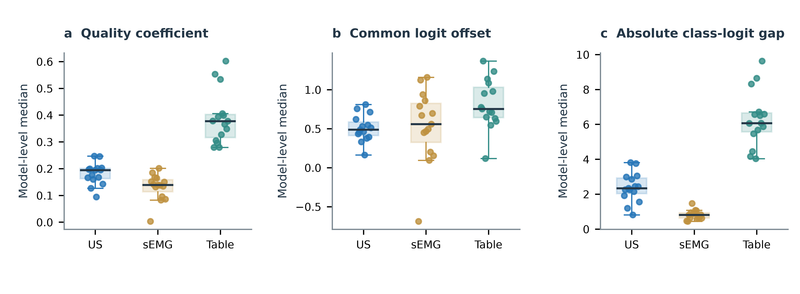
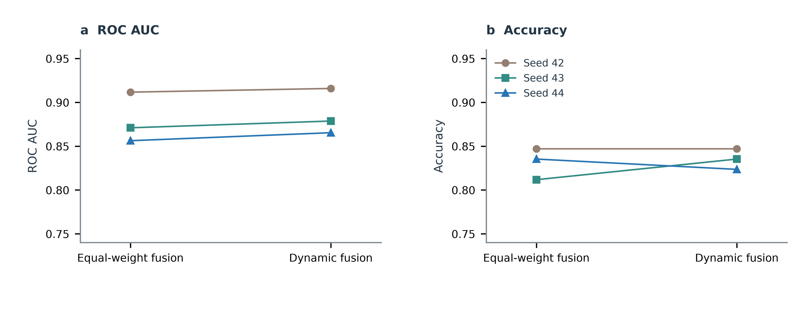
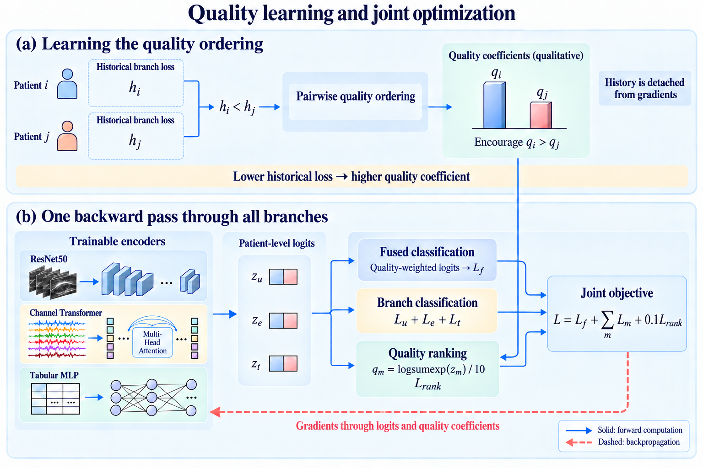
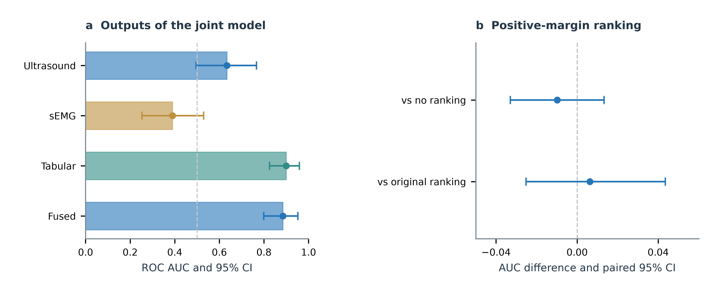

# Supplementary material

## Quality-aware fusion of ultrasound, surface electromyography, and clinical indicators for sarcopenia classification

## S1. Preprocessing details

**Fig. S1.** Preprocessing of the three modalities. An existing U-Net ensemble generates ultrasound region polygons, followed by cropping with a 15% context margin, aspect-preserving resizing, and normalization. The sEMG pipeline produces waveform windows and channel-specific feature matrices. Tabular screening, imputation, and standardization are fitted on the training patients. Images and waveforms are schematic. Created with OpenAI’s image-generation tool.

### S1.1. Electromyographic features

Each channel contributes 24 features. The six time-domain features are root mean square, mean absolute value, absolute peak amplitude, zero-crossing count, waveform length, and slope-sign-change count. The nine Fourier-spectrum features comprise five band energies, spectral centroid, peak frequency, median frequency, and mean power frequency. Spectral centroid and mean power frequency retain separate feature positions from the existing implementation, although their formulas are identical.

The five frequency bands are 0–50, 50–100, 100–200, 200–400, and 400–500 Hz. Short-time Fourier features summarize mean spectral energy in these bands using a window length of 64, a hop size of 32, and a transform length of 128. A three-level db4 wavelet decomposition provides four coefficient-energy features. Feature extraction is repeated after sEMG noise augmentation so that waveform and feature inputs describe the same perturbed signal.

### S1.2. Exceptional records

Previously filtered records use the available contraction markers and are interpolated to 10,000 samples per interval. A missing channel is filled according to the fixed channel mapping using the sample-wise median of the remaining valid channels. These processing rules are fixed before classifier training. No classification label is used in waveform interpolation or channel reconstruction.

### S1.3. Upstream region segmentation

The existing U-Net training script specifies five patient-grouped folds using StratifiedGroupKFold with random seed 42. It uses a maximum of 60 epochs, a batch size of eight, AdamW with learning rate 10⁻³ and weight decay 10⁻⁴, and cosine learning-rate scheduling. The loss equally weights binary cross-entropy and soft Dice loss. Model selection uses validation Dice, with early-stopping patience set to ten. These settings describe the separately trained segmentation models used for preprocessing.

The updated-data inference script averages probability maps from all five segmentation checkpoints. Its run metadata records 85 patients and 563 images with region annotations after the automatic annotations of four unsegmentable images were removed. The classifier subsequently reads the region-cropping manifest. The earlier segmentation refinement routine, which used fold-specific inference, and this five-model ensemble inference are separate procedures. The segmentation training patients overlap with the 85 classification patients, as confirmed by the study team; the image collections partly differ. Consequently, using all five segmentation models for every patient does not preserve patient independence across the complete segmentation-to-classification pipeline.

## S2. Complete classifier configuration

**Table S1**  
Training and evaluation configuration for the enhanced model.

| Item | Configuration |
|---|---|
| Cohort | 85 patients: 62 positive and 23 negative |
| Outer classification split | StratifiedKFold; five folds; seed 20260911 |
| Epoch-selection split per fold | 51 training and 17 validation patients |
| Epoch selection | 100 epochs; minimum validation log loss |
| Selection patience | 100 |
| Final refitting per fold | Reinitialize; train on 68 patients for selected epoch E |
| Outer test set per fold | 17 patients |
| Training seeds | 42, 43, 44; fitting seed also incorporates fold index |
| Ultrasound initialization | ImageNet ResNet50 backbone; random classification head |
| sEMG and tabular initialization | Random |
| Parameters updated | All parameters of the three classification branches |
| Optimizer | AdamW |
| ResNet50 backbone learning rate | 1 × 10⁻⁵ |
| Other-parameter learning rate | 2 × 10⁻⁴ |
| Weight decay | 1 × 10⁻³ |
| AdamW betas and epsilon | (0.9, 0.999); 1 × 10⁻⁸ |
| Learning-rate scheduler | None |
| Batch size | Six patients; retain final incomplete batch |
| Gradient clipping | Maximum global norm of five |
| Ultrasound head | Dropout 0.35; linear 2048 → 2 |
| sEMG waveform projection | Shared channel-wise linear map: 100 → 128 |
| sEMG feature projection | Shared channel-wise layer normalization and MLP: 24 → 128 → 128 |
| Channel Transformer | Four layers; eight heads; width 128; feedforward width 256 |
| Transformer normalization and dropout | Pre-normalization; dropout 0.2 |
| sEMG classification head | Layer normalization; 128 → 64 → 2 |
| Tabular architecture | D → 64 → 32 → 2; first-layer normalization; GELU; dropout 0.2 |
| Training observations per patient | One image; eight windows per interval, 40 in total; one tabular row |
| Validation and test observations | All images and all 1,655 windows |
| Observation aggregation | Mean logits before fusion |
| Maximum sEMG inference batch | 256 windows |
| Class weight for class c | Training count n divided by 2n꜀ |
| Classification-loss coefficients | One for the fused output and each branch |
| Ranking mode and coefficient | Positive margin; 0.1 |
| Quality coefficient | Log-sum-exp of logits divided by ten |
| Added-noise probability | 0.5 per sampled patient |
| Modality selection for noise | Uniform among three modalities; one modality per event |
| Ultrasound noise | Standard deviation sampled uniformly from [0, 0.1] in [0, 1] pixel units |
| sEMG and tabular noise | Standard deviation sampled uniformly from [0, 1] in standardized units |
| Basic image augmentation | Flip probability 0.5; brightness [0.92, 1.08]; contrast [0.90, 1.10] |
| Tabular screening | Remove fields with >50% missingness or constant values |
| Tabular imputation and scaling | Training medians, means, and standard deviations |
| Decision threshold | 0.5 |
| Seed ensemble | Mean positive-class probability per patient |
| Test perturbation levels | 0, 0.25, 0.5, 1, 2; three matched realizations |
| Statistical intervals | 10,000 stratified patient bootstrap samples |
| Method differences | Paired patient resampling |
| Software and hardware | Python 3.11; PyTorch 2.4.0; CUDA 12.4; RTX 3060 Laptop GPU |
| Data loading | Zero loader workers; two CPU threads |

## S3. Historical comparisons and ranking ablations

**Table S2**  
Fusion methods under the earlier training protocol. These runs use a maximum of 100 epochs with early-stopping patience 12 and do not include the new single-modality noise augmentation. Values are three-seed ensemble results.

| Method | AUC | Accuracy (%) | Balanced accuracy (%) | Sensitivity (%) | Specificity (%) |
|---|---:|---:|---:|---:|---:|
| Equal-weight fusion | 0.8541 | 82.35 | 72.86 | 93.55 | 52.17 |
| Dynamic fusion | 0.8703 | 83.53 | 75.04 | 93.55 | 56.52 |
| Trusted multi-view classification | 0.9004 | 81.18 | 67.95 | 96.77 | 39.13 |

TMC had the highest AUC in this earlier comparison, while dynamic fusion had higher fixed-threshold accuracy. The main comparison evaluates dynamic and equal-weight fusion under the enhanced protocol.

**Table S3**  
Ranking ablations under the earlier training protocol. All settings use the same patient classification splits.

| Ranking setting | AUC | Accuracy (%) | Balanced accuracy (%) | Log loss |
|---|---:|---:|---:|---:|
| No ranking, λr = 0 | 0.8801 | 82.35 | 74.23 | 0.3653 |
| Original ranking implementation | 0.8640 | 81.18 | 73.42 | 0.3876 |
| Positive-margin ranking | 0.8703 | 83.53 | 75.04 | 0.3766 |

The positive-margin minus no-ranking AUC difference was −0.0098 (95% CI: −0.0330 to 0.0133). The positive-margin minus original-ranking difference was 0.0063 (95% CI: −0.0252 to 0.0435). These experiments have not been repeated under noise augmentation.

Compared with the earlier dynamic model, enhanced dynamic fusion improved AUC by 0.0147 (95% CI: −0.0084 to 0.0407). This is a comparison of complete training protocols: both augmentation and epoch selection changed. The matched enhanced equal-weight model is therefore the primary comparator for the fusion rule.

## S4. Logit scale and additional perturbation findings

### S4.1. Common-shift sensitivity

The coefficient in Eq. (3) depends on the common offset of the two branch logits. Adding the same scalar a to both logits leaves their softmax probabilities unchanged but changes the coefficient by a/10:

$$
q(\mathbf z+a\mathbf 1)=q(\mathbf z)+\frac{a}{10}.
\tag{S1}
$$

In a previously completed diagnostic on the earlier dynamic model, subtracting five from both logits of one branch changed the fused predicted class for 17 of 85 patients when applied to ultrasound, seven when applied to sEMG, and 33 when applied to the tabular branch. This test describes a structural property of the fusion rule and does not involve retraining.

Under clean inputs, the 255 patient–seed predictions contained eight negative sEMG coefficients (minimum −0.01033). The minimum ultrasound and tabular coefficients were 0.07745 and 0.11095, with no negative values. These counts summarize model outputs, not 255 independent patients.

### S4.2. Conditions favoring equal-weight fusion

At ultrasound perturbation level 0.5, the dynamic-minus-equal difference in accuracy change was −0.0392 (95% CI: −0.0824 to −0.0078). Under all four nonzero sEMG perturbation levels, dynamic fusion also had a less favorable relative change in log loss. These conditions favor equal weighting and complement the modality-dependent behavior in the main AUC curves.

### S4.3. Score distributions across branch encoders

Figure S2 summarizes the enhanced model’s output scales. For each of the 15 seed–fold models and each modality, we calculate the median quality coefficient, the median common logit offset (the mean of the two logits), and the median absolute difference between the class logits across its 17 test patients. This gives one point per fitted model. The distributions reveal the scales on which the heterogeneous encoders produce their outputs; the within-fold correlations in Fig. 5 evaluate the quality–loss association separately within those models.

**Fig. S2.** Model-level distributions of (a) quality coefficients, (b) common logit offsets, and (c) absolute class-logit gaps under clean inputs. Each point is a within-model median from 17 test patients, with 15 seed–fold models per modality. Boxes indicate the median and interquartile range; whiskers extend to the most extreme values within 1.5 interquartile ranges. All model medians are shown. These are descriptive distributions of model outputs.

## S5. Additional probabilistic results

**Table S4**  
Patient-level metrics of enhanced dynamic fusion with 95% bootstrap confidence intervals.

| Metric | Estimate | 95% CI |
|---|---:|---|
| AUC | 0.8850 | 0.8001–0.9509 |
| Accuracy | 0.8588 | 0.7882–0.9176 |
| Sensitivity | 0.9516 | 0.8871–1.0000 |
| Specificity | 0.6087 | 0.3913–0.7826 |
| Balanced accuracy | 0.7802 | 0.6715–0.8808 |
| F1 score | 0.9077 | 0.8636–0.9466 |
| Brier score | 0.1120 | 0.0775–0.1509 |
| Log loss | 0.3523 | 0.2471–0.4837 |

The confusion counts were 59 true positives, three false negatives, 14 true negatives, and nine false positives. Confidence intervals use patients as the resampling unit and condition on the saved fitted models.

## S6. Variation across training seeds

The patient folds remain fixed across seeds 42, 43, and 44. Figure S3 connects the two methods evaluated with the same training seed. Each point is an AUC or accuracy calculated from that seed’s 85 out-of-fold patient predictions. The main-text ensemble first averages the three probabilities for each patient and then calculates the metrics; the table below instead summarizes the three individual-seed metrics.

**Table S5**  
Individual-seed performance under enhanced training, reported as mean ± sample standard deviation across three seeds.

| Method | AUC | Accuracy (%) |
|---|---:|---:|
| Equal-weight fusion | 0.8796 ± 0.0287 | 83.14 ± 1.80 |
| Dynamic fusion | 0.8866 ± 0.0262 | 83.53 ± 1.18 |

**Fig. S3.** Seed-level (a) AUC and (b) accuracy for the matched fusion methods. Lines connect the same seed across methods. Colors and symbols identify seeds 42, 43, and 44; each point summarizes all 85 out-of-fold patients. The seed comparisons are descriptive.

## S7. Additional interval calculations and figure source data

The branch-head AUC intervals and paired ranking comparisons in Supplementary Fig. S6 were calculated from the saved three-seed patient probabilities using 10,000 class-stratified bootstrap draws with random seed 20260922. Each draw preserves 62 positive and 23 negative patients. Identical draws are applied to both ranking settings in each contrast. The fused-head interval is reused from the main classification analysis to keep repeated displays identical. Numerical interval endpoints for the ranking contrasts were regenerated together with the figure; their estimates and interpretation are unchanged. Source tables preserve the original predictions, model identifiers, derived metrics, and interval estimates.

Quantitative figures were produced with Python/matplotlib from these saved results. Box plots show distributions across fitted models; confidence intervals use patients as the resampling unit. The scripts preserve all patients and model outputs used in the respective analyses.

## S8. Encoder architecture and gradient propagation

**Fig. S4.** Channel Transformer for sEMG. Waveform and handcrafted-feature projections are added for each channel. The six channel tokens and a classification token are processed by four Transformer layers. A classification head produces window logits, which are averaged within each patient. CLS denotes the classification token.

The quality coefficients remain differentiable. If gᵢ is the gradient of the fused classification loss with respect to the fused logits, the corresponding gradient reaching branch m is

$$
\frac{\partial L_f}{\partial\mathbf z_i^m}
=q_{i,m}\mathbf g_i+
\frac{\mathbf g_i^{\mathsf T}\mathbf z_i^m}{10}
\operatorname{softmax}(\mathbf z_i^m).
\tag{S2}
$$

The first term follows the weighted-logit path; the second follows the quality-estimation path. These gradients combine with branch-classification and ranking gradients in a single backward pass (Fig. S5). The model therefore learns the branch representations and their fusion coefficients together.

**Fig. S5.** Quality learning and joint optimization. (a) Historical branch losses supply pairwise targets that encourage larger coefficients for patients with smaller losses. The coefficient bars illustrate the desired ordering. (b) Fused classification, branch classification, and quality ranking jointly supervise the three encoders. The loss history is detached, while gradients pass through both the logits and quality coefficients. Created with OpenAI’s image-generation tool.

## S9. Additional experiments and reproducibility

The three independent modalities, ultrasound–tabular fusion, and no-noise dynamic model each comprise five outer folds and three training seeds, giving 75 final fitted classifiers. Their train, validation, and test identifiers match those of the main comparison. These additional experiments used an NVIDIA A800 and PyTorch 2.4.0 with CUDA 12.1. Main dynamic and equal-weight training used the RTX 3060 configuration in Table S1. All retained model files and result files were transferred and checked against their source SHA-256 checksums.

For single-modality models, the active branch is trained with one weighted cross-entropy loss. Inactive encoders are excluded. For two-modality fusion, the fused loss, the two branch losses, and ranking losses supervise only the active branches. Noise sampling retains the three-modality selection space, preserving a 1/6 perturbation probability for each active modality. The no-noise ablation disables added Gaussian noise but retains basic ultrasound augmentation.

The final clean-data comparisons use 10,000 class-stratified bootstrap draws with seed 20260923. Historical ranking and perturbation analyses retain their original documented bootstrap draws. Small changes in the endpoints of repeated clean-model intervals reflect resampling variation; the final clean-data table below is the authoritative interval set for this manuscript.

**Table S6**  
Complete clean-data metric intervals. Values are proportions unless otherwise indicated.

| Model | Metric | Estimate | 95% CI |
|---|---|---:|---|
| Ultrasound only | roc auc | 0.5182 | 0.3857–0.6480 |
| Ultrasound only | accuracy | 0.7176 | 0.6941–0.7294 |
| Ultrasound only | sensitivity | 0.9839 | 0.9516–1.0000 |
| Ultrasound only | specificity | 0.0000 | 0.0000–0.0000 |
| Ultrasound only | balanced accuracy | 0.4919 | 0.4758–0.5000 |
| Ultrasound only | f1 | 0.8356 | 0.8194–0.8435 |
| Ultrasound only | brier | 0.2091 | 0.1916–0.2277 |
| Ultrasound only | log loss | 0.6145 | 0.5641–0.6687 |
| sEMG only | roc auc | 0.4376 | 0.3015–0.5758 |
| sEMG only | accuracy | 0.6941 | 0.6235–0.7529 |
| sEMG only | sensitivity | 0.9032 | 0.8226–0.9677 |
| sEMG only | specificity | 0.1304 | 0.0000–0.2609 |
| sEMG only | balanced accuracy | 0.5168 | 0.4435–0.5982 |
| sEMG only | f1 | 0.8116 | 0.7647–0.8511 |
| sEMG only | brier | 0.2285 | 0.2099–0.2475 |
| sEMG only | log loss | 0.6495 | 0.6103–0.6896 |
| Blood and clinical only | roc auc | 0.8850 | 0.7938–0.9544 |
| Blood and clinical only | accuracy | 0.7882 | 0.7059–0.8706 |
| Blood and clinical only | sensitivity | 0.8226 | 0.7258–0.9194 |
| Blood and clinical only | specificity | 0.6957 | 0.5217–0.8696 |
| Blood and clinical only | balanced accuracy | 0.7591 | 0.6511–0.8622 |
| Blood and clinical only | f1 | 0.8500 | 0.7805–0.9106 |
| Blood and clinical only | brier | 0.1205 | 0.0790–0.1672 |
| Blood and clinical only | log loss | 0.3754 | 0.2531–0.5220 |
| Ultrasound + blood and clinical | roc auc | 0.8829 | 0.7959–0.9509 |
| Ultrasound + blood and clinical | accuracy | 0.8471 | 0.7765–0.9176 |
| Ultrasound + blood and clinical | sensitivity | 0.9355 | 0.8710–0.9839 |
| Ultrasound + blood and clinical | specificity | 0.6087 | 0.3913–0.7826 |
| Ultrasound + blood and clinical | balanced accuracy | 0.7721 | 0.6634–0.8752 |
| Ultrasound + blood and clinical | f1 | 0.8992 | 0.8504–0.9440 |
| Ultrasound + blood and clinical | brier | 0.1139 | 0.0785–0.1537 |
| Ultrasound + blood and clinical | log loss | 0.3618 | 0.2507–0.5022 |
| Trimodal dynamic, no noise augmentation | roc auc | 0.8710 | 0.7875–0.9383 |
| Trimodal dynamic, no noise augmentation | accuracy | 0.8235 | 0.7529–0.8941 |
| Trimodal dynamic, no noise augmentation | sensitivity | 0.9355 | 0.8710–0.9839 |
| Trimodal dynamic, no noise augmentation | specificity | 0.5217 | 0.3043–0.7391 |
| Trimodal dynamic, no noise augmentation | balanced accuracy | 0.7286 | 0.6224–0.8317 |
| Trimodal dynamic, no noise augmentation | f1 | 0.8855 | 0.8387–0.9291 |
| Trimodal dynamic, no noise augmentation | brier | 0.1236 | 0.0879–0.1630 |
| Trimodal dynamic, no noise augmentation | log loss | 0.3753 | 0.2782–0.4871 |
| Trimodal dynamic fusion | roc auc | 0.8850 | 0.8001–0.9509 |
| Trimodal dynamic fusion | accuracy | 0.8588 | 0.7882–0.9176 |
| Trimodal dynamic fusion | sensitivity | 0.9516 | 0.8871–1.0000 |
| Trimodal dynamic fusion | specificity | 0.6087 | 0.3913–0.7826 |
| Trimodal dynamic fusion | balanced accuracy | 0.7802 | 0.6715–0.8808 |
| Trimodal dynamic fusion | f1 | 0.9077 | 0.8636–0.9466 |
| Trimodal dynamic fusion | brier | 0.1120 | 0.0775–0.1509 |
| Trimodal dynamic fusion | log loss | 0.3523 | 0.2471–0.4837 |
| Trimodal equal-weight fusion | roc auc | 0.8836 | 0.7945–0.9530 |
| Trimodal equal-weight fusion | accuracy | 0.8471 | 0.7765–0.9059 |
| Trimodal equal-weight fusion | sensitivity | 0.9516 | 0.8871–1.0000 |
| Trimodal equal-weight fusion | specificity | 0.5652 | 0.3478–0.7391 |
| Trimodal equal-weight fusion | balanced accuracy | 0.7584 | 0.6497–0.8615 |
| Trimodal equal-weight fusion | f1 | 0.9008 | 0.8571–0.9394 |
| Trimodal equal-weight fusion | brier | 0.1172 | 0.0840–0.1542 |
| Trimodal equal-weight fusion | log loss | 0.3683 | 0.2804–0.4721 |

## S10. Internal branch outputs and historical component visualization

The jointly trained branch heads achieved AUCs of 0.6339 (ultrasound), 0.3899 (sEMG), and 0.8997 (tabular), compared with 0.8850 for the fused prediction. These heads share a joint training objective and are distinct from the independent single-modality models in Table 2.

**Fig. S6.** Internal-head AUCs under the main protocol and paired ranking comparisons under the earlier protocol. Error bars show patient bootstrap confidence intervals. The panels describe separate experimental settings.

## S11. Tabular field inventory

[Supplementary Data S1](sources/Supplementary_Data_S1_fields.csv) lists all 95 candidate fields in model order, their source names, and English descriptions. It contains 40 clinical fields and 55 laboratory fields. Training-fold screening determines which candidates enter a fitted model. The inventory preserves source terminology, including the source field named “AST/AL” and a separate glutamate-aminotransferase field. Measurement units and acquisition timing require confirmation from the original clinical data dictionary.
