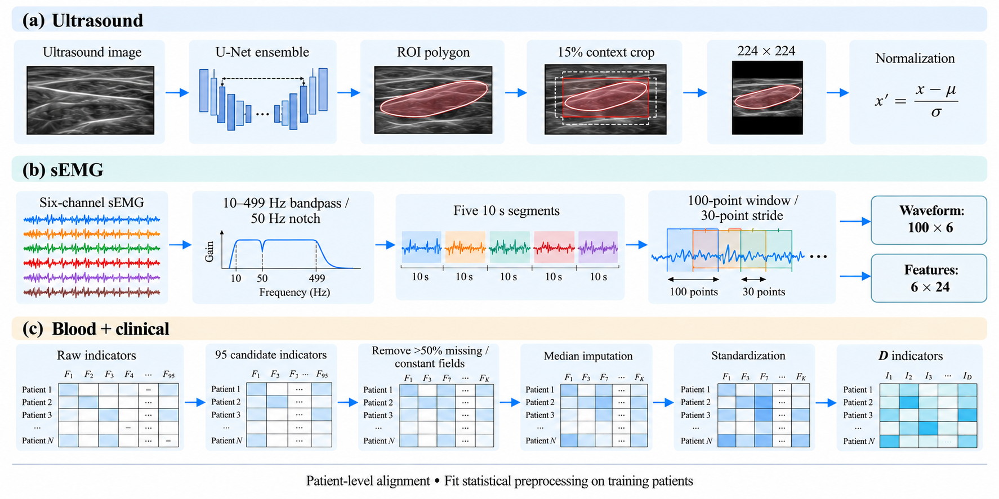

# 补充方法与结果

**图S1｜三路数据预处理。** 上游U-Net生成超声区域多边形，增加15%上下文后裁剪、缩放和归一化。肌电分别构建波形与特征输入；表格使用训练患者拟合的筛选、填补和标准化参数。图中输入为示意。

## S1 肌电特征与特殊记录

每通道的24项特征由四组组成。时域特征包括均方根、平均绝对值、绝对峰值、过零次数、波形长度及斜率符号变化次数。傅里叶频谱特征包括五频带能量，以及频谱质心、峰值频率、中值频率和平均功率频率。频谱质心与平均功率频率沿用原实现，占据两个特征位置但计算式相同。

五个频带为0～50、50～100、100～200、200～400及400～500 Hz。短时傅里叶变换窗长64、步长32、变换点数128，提取各频带的平均谱能量；小波变换采用db4三级分解，计算四组系数能量。

已滤波的特殊记录依据已有标记提取收缩段，并插值至每段10,000点；缺失通道依据固定通道审计映射，以其余有效通道的逐采样中位数补齐。处理规则在训练前固定。

## S2 训练参数

| 项目 | 配置 |
|---|---|
| 分类队列 | 85名患者；62名肌少症、23名非肌少症 |
| 外层分类划分 | StratifiedKFold，5折；种子20260911 |
| 每折选轮 | 51训练＋17验证，100轮，验证对数损失最低轮E |
| 每折重训 | 68人，从初始化训练E轮；测试17人 |
| 训练随机种子 | 42、43、44；实际拟合种子结合折编号 |
| 初始化 | ResNet50主干使用ImageNet；其余随机初始化 |
| 更新参数 | 三分支全部参数；U-Net固定为上游预处理 |
| 优化器 | AdamW |
| 主干学习率 | 1×10⁻⁵ |
| 其他参数学习率 | 2×10⁻⁴ |
| 权重衰减 | 1×10⁻³ |
| AdamW β、ε | (0.9, 0.999)、1×10⁻⁸ |
| 学习率调度 | 无 |
| 患者批量 | 6；不丢弃末批 |
| 梯度裁剪 | 总范数5 |
| 选轮阶段patience | 100；最大100轮 |
| ResNet50输出头 | Dropout 0.35；2048→2 |
| 肌电Transformer | 4层；8头；宽度128；前馈256；Dropout 0.2；先归一化 |
| 肌电波形映射 | 每通道100→128，共享参数 |
| 肌电特征映射 | 每通道24→128→128，共享参数 |
| 肌电分类头 | LayerNorm；128→64→2 |
| 表格网络 | D→64→32→2；首层LayerNorm；GELU；Dropout 0.2 |
| 训练观测采样 | 每患者1张图；5段各8窗；1行表格 |
| 验证、测试观测 | 全部图像、全部1,655窗；先平均分类分数 |
| 肌电推理批量上限 | 256窗 |
| 类别权重 | n/(2n꜀)，由当次训练患者计算 |
| 分类项系数 | 融合与三个分支各1 |
| 排序系数 | 0.1；正间隔排序 |
| 质量系数 | logsumexp(z)/10，未经归一化 |
| 噪声增强 | 概率0.5；三模态等概率选一路 |
| 超声噪声幅度 | 标准差均匀取0～0.1，0～1像素单位 |
| 肌电、表格噪声幅度 | 标准差均匀取0～1，训练标准化单位 |
| 训练图像增强 | 水平翻转0.5；亮度0.92～1.08；对比度0.90～1.10 |
| 表格筛选 | 删除缺失>50%的列和常数列；训练中位数填补、标准化 |
| 判定阈值 | 0.5 |
| 集成 | 同一患者的三个种子正类概率平均 |
| 测试扰动 | 强度0、0.25、0.5、1、2；3次匹配重复 |
| 患者置信区间 | 类别分层Bootstrap，10,000次；模型比较配对抽样 |
| 计算环境 | Python 3.11，PyTorch 2.4.0，CUDA 12.4；RTX 3060 Laptop GPU |
| 数据加载 | num_workers=0；CPU线程数2 |

## S3 历史方法与排序对照

**表S1｜常规训练方案的三种融合方法。** 本组使用原有选轮设置，最大100轮、patience为12；未使用主线的随机单模态噪声增强。

| 方法 | ROC AUC | 准确率 | 平衡准确率 | 敏感度 | 特异度 |
|---|---:|---:|---:|---:|---:|
| 等权晚期融合 | 0.8541 | 82.35% | 72.86% | 93.55% | 52.17% |
| 动态质量融合 | 0.8703 | 83.53% | 75.04% | 93.55% | 56.52% |
| 可信多视图分类（TMC） | 0.9004 | 81.18% | 67.95% | 96.77% | 39.13% |

**表S2｜常规训练中的排序消融。** 所有方法使用相同分类划分；本组未在增强训练设置下重跑。

| 排序设置 | ROC AUC | 准确率 | 平衡准确率 | 对数损失↓ |
|---|---:|---:|---:|---:|
| 无排序项，λ排序=0 | 0.8801 | 82.35% | 74.23% | 0.3653 |
| 原仓库排序 | 0.8640 | 81.18% | 73.42% | 0.3876 |
| 当前正间隔排序 | 0.8703 | 83.53% | 75.04% | 0.3766 |

当前正间隔排序减去原仓库排序的AUC差值为0.0063，配对95%置信区间为−0.0273～0.0428。增强动态融合减去常规动态融合的AUC差值为0.0147，区间为−0.0084～0.0407；这一比较同时包含增强与选轮方案的变化。

## S4 分支输出头

| 输出头 | ROC AUC | 准确率 | 敏感度 | 特异度 |
|---|---:|---:|---:|---:|
| 超声 | 0.6339 | 71.76% | 98.39% | 0.00% |
| 肌电 | 0.3899 | 65.88% | 87.10% | 8.70% |
| 血液与临床指标 | 0.8997 | 80.00% | 82.26% | 73.91% |
| 融合 | 0.8850 | 85.88% | 95.16% | 60.87% |

前三行由联合训练模型内部输出头计算，并非独立训练的单模态模型。

## S5 分数尺度与其他扰动结果

质量系数依赖分类分数的绝对位置。对某一分支的两个分类分数同时加上常数c，其Softmax概率不变，但质量系数增加c/10。因此质量系数与分支概率具有不同的尺度性质。既有常规模型的平移测试中，对超声、肌电或表格分数分别同时减去5，可改变17、7或33名患者的融合分类结果。这一实验说明应将q解释为当前模型内部的动态系数。

扰动比较也存在等权融合更好的条件。超声强度0.5时，动态融合相对等权融合的准确率变化差值为−0.0392（95%区间−0.0824～−0.0078）；肌电各非零强度下，动态融合的对数损失相对变化也更大。正文以整体分类、表格扰动趋势及超声失效缓解为主要结果，完整统计表保存在数据源目录。

## S6 上游ROI模型

现有U-Net训练脚本采用患者级StratifiedGroupKFold，五折、随机种子42；最大60轮，批量8，AdamW学习率10⁻³、权重衰减10⁻⁴，余弦学习率调度，以验证Dice选择模型，早停耐心为10。上述参数来自既有训练脚本，不是本次三分支训练参数。

更新数据的自动标注脚本读取五个既有权重，对每张图像平均预测概率后生成ROI。自动标注运行元数据记录85名患者、563张具有ROI的图像，并记录已移除4张无法分割图像的自动标注。当前分类清单据这些区域进行裁剪；图像数量及特殊原图以分类清单为准。

分割脚本中的折外区域优化和更新数据上的五模型平均推理是两条不同路径。现有记录尚不足以确认既有分割训练患者与当前分类患者的完整对应关系，不能把五模型集成直接称为当前分类的折外分割。
