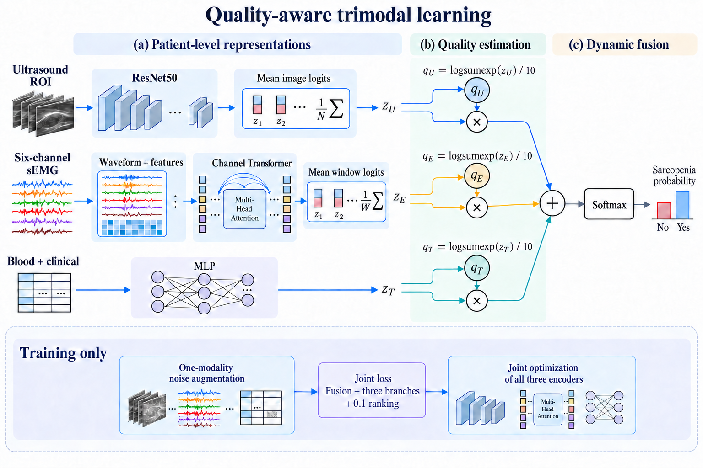
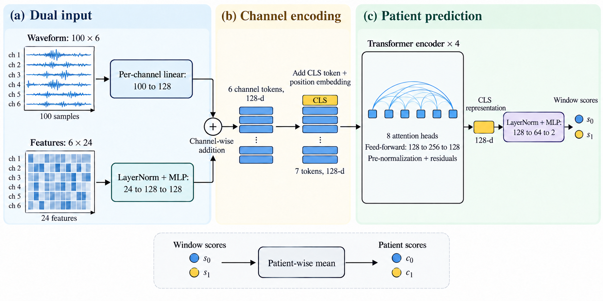
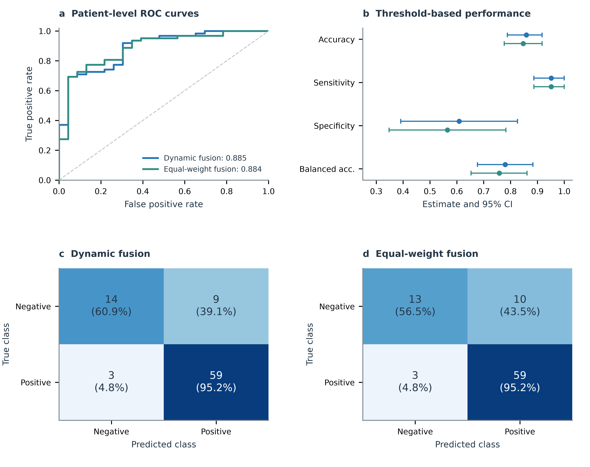
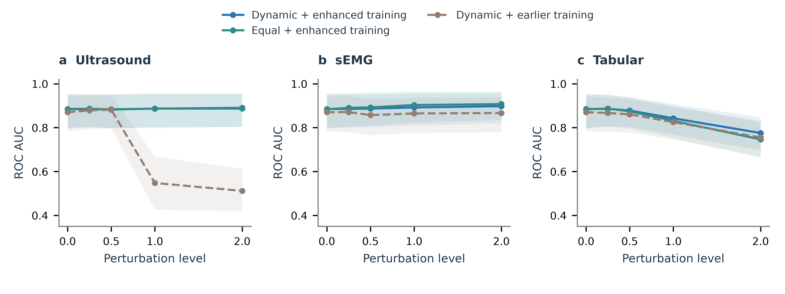
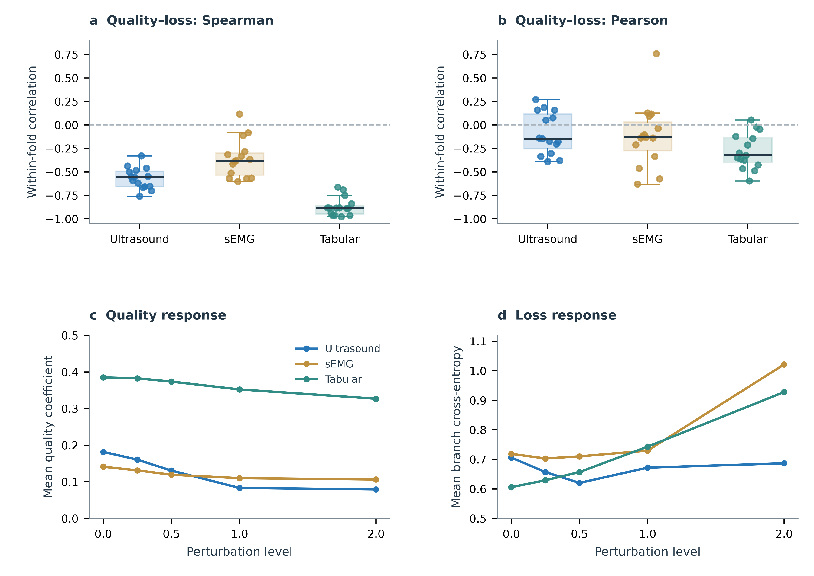

# 质量感知的鲁棒多模态融合用于肌少症分类：联合超声、表面肌电与血液及临床指标

## 摘要

肌少症的多模态评估涉及肌肉形态、神经肌肉活动和全身生理状态，不同信息来源的质量差异增加了联合建模的难度。本研究引入质量感知的动态融合方法，将超声感兴趣区域、六通道表面肌电以及血液与临床指标整合为患者级预测。模型分别采用残差网络、通道 Transformer 和多层感知机编码三类输入，根据各分支的分类输出计算质量系数，并通过分支监督、融合监督和质量排序约束联合训练。训练期间随机扰动一种模态，使模型适应输入质量变化。在85名患者的患者级分层五折评估中，三个随机种子集成后的准确率为85.88%，受试者工作特征曲线下面积为0.8850，敏感度与特异度分别为95.16%和60.87%。相同训练设置下，等权融合的准确率为84.71%，曲线下面积为0.8836。最高测试强度的超声噪声下，增强动态融合保持0.8871的曲线下面积；表格扰动下，其曲线下面积为0.7756，高于等权融合的0.7464。上述结果表明，患者级质量感知融合能够整合异构输入，并在所测试的质量扰动条件下维持较稳定的分类表现。

**关键词：** 肌少症；多模态学习；超声；表面肌电；动态融合；鲁棒性

## 1 引言

肌少症涉及肌肉结构与功能的共同变化。在卒中康复场景中，神经损伤、活动减少和营养状态变化可能同时影响骨骼肌，使单一测量难以完整描述患者的肌肉状态[1]。围绕这一问题，联合肌肉形态、神经肌肉活动和血液及临床信息开展评估，为肌少症分类提供了多层次的观察依据。

超声能够呈现局部肌肉形态和回声特征，表面肌电记录肌肉激活过程中的电活动，血液与临床指标则补充全身状态及功能信息。已有研究探索了超声与卒中相关肌少症的关系[2]，以及利用表面肌电特征进行肌少症筛查的可行性[3]。这些信息具有不同的数据结构：同一患者可能对应多张图像、一段包含多个收缩阶段的肌电记录，以及一行结构化指标。实现联合分类首先需要将数量不一致的观测组织为可比较的患者级表示。

另一个关键问题是模态质量不均衡。图像伪影、肌电噪声和指标波动会改变各分支的预测可靠性，固定权重难以适应患者之间的差异。质量感知动态融合通过建立融合系数与模态预测质量之间的联系，为异构数据整合提供了方法基础[4]。在小样本医学分类中，除了学习这种联系，还需要让模型在训练时接触质量变化，避免受损输入产生过大的分类分数并主导融合。

本研究构建患者级三模态分类流程，将超声区域图像、六通道肌电和血液及临床指标分别映射为分类分数，再由质量系数动态组合。通道 Transformer 联合处理肌电波形与逐通道特征；随机单模态噪声增强与分类、排序目标共同优化三个分支。实验依次评估常规分类表现、质量系数与分支损失的关系，以及不同模态受扰动时的性能变化。

## 2 材料与方法

### 2.1 研究数据与患者级组织

本研究的分析队列包含85名患者，其中肌少症62名、非肌少症23名。每名患者具有2～14张超声感兴趣区域图像、六通道肌电数据，以及血液与临床指标。表格包含95项候选字段，其中临床指标40项、血液指标55项。

三类输入通过患者编号关联。模型以患者为训练采样和评估单位，同一患者的全部图像、肌电窗口及表格记录保持在同一分类数据划分中。图像与窗口在各分支内汇总为患者级分类分数后参与融合，从而避免观测数量较多的患者在测试指标中被重复计数。

三路预处理流程见补充图S1。

### 2.2 超声区域定位与图像预处理

超声预处理采用已有的 U-Net 自动区域标注流程。U-Net[6]使用四级编码—解码结构，通道数依次为32、64、128和256，瓶颈通道数为512，并通过跳跃连接保留空间细节。推理时将灰度图像复制为三通道，缩放至256×256并归一化；五个既有分割模型输出的概率图取平均，恢复到原图尺寸后以0.5为阈值生成掩码。随后保留最大连通区域、填充轮廓并进行形态学闭运算，输出肌肉区域多边形。

分类流程读取这些区域标注，沿多边形外接框增加15%的上下文范围后裁剪。裁剪图像保持长宽比缩放至不超过224×224，居中补黑边，并使用 ImageNet 均值与标准差归一化。训练采用概率为0.5的水平翻转，以及0.92～1.08倍亮度和0.90～1.10倍对比度变化。自动区域定位作为预先完成的图像处理步骤，分割模型不参与三模态分类的联合优化。

训练时，每次抽到一名患者随机使用其一张图像；验证和测试使用该患者的全部图像，取图像分类分数的平均值。

### 2.3 肌电信号处理

肌电采样率为1,000 Hz。统一六个通道的顺序后，对原始信号进行三阶10～499 Hz Butterworth带通滤波和50 Hz陷波滤波，陷波品质因数为35，均采用前后向滤波。提取50～60、70～80、90～100、110～120及130～140 s五段收缩信号，每段10 s。每段以100点窗长、30点步长切分为331个窗口，每名患者合计1,655个窗口。

通道均值与标准差仅由当次训练患者估计，并用于波形标准化。每个窗口同时生成每通道24项特征：6项时域特征、9项傅里叶频谱特征、5项短时傅里叶谱特征和4项小波能量特征，形成6×24的特征矩阵。波形与特征共同输入肌电分支。

训练时从每段收缩中随机抽取8个窗口，共40窗；验证和测试使用全部窗口。先对段内窗口分类分数求平均，再对五段求平均，得到患者级肌电分数。各段窗口数相同，因此该汇总等价于全部窗口等权平均。特殊记录的通道补齐及已滤波信号处理见补充方法。

### 2.4 血液与临床指标处理

在当次训练数据中，删除缺失比例超过50%的字段与常数列。其余字段以训练集列中位数填补缺失，再按训练集均值和标准差进行标准化。保留维数记为D，决定表格网络的输入大小。验证与测试复用相应训练集拟合的字段集合、填充值和标准化参数。

### 2.5 三分支特征编码

图1展示整体模型。三条分支采用适合其输入结构的编码器，均输出两个未经归一化的分类分数，分别对应非肌少症与肌少症。

**图1｜质量感知三模态融合框架。** 超声和肌电分别在图像、窗口层面编码，再在患者内平均分类分数。血液与临床指标经多层感知机直接产生患者级分数。各路分数计算质量系数，与自身相乘后求和，经Softmax输出二分类概率。底部为训练策略。图中的图像、波形与表格为结构示意。

**超声分支。** 采用ResNet50[5]，经全局平均池化得到2,048维表示，再经过丢弃率0.35的Dropout及线性二分类头。主干使用ImageNet权重初始化，分类头随机初始化，全部参数参与更新。该分支包含23,512,130个参数。

**肌电分支。** 对一个100×6波形窗口，逐通道使用共享线性映射将100点波形映射至128维；对对应的24项特征，使用LayerNorm和24→128→128映射形成另一组128维表示。同一通道的两种表示相加，构成六个通道标记，再加入分类标记与位置嵌入。四层Transformer学习通道关系，每层包含8个注意力头，前馈层维数256，Dropout为0.2。分类标记经过LayerNorm及128→64→2分类头产生窗口分数（图2）。该分支包含572,274个参数，从随机初始化开始训练。

**图2｜波形与特征联合驱动的通道Transformer。** 原始波形表示与人工特征表示按通道相加，注意力作用于六个通道标记和分类标记。窗口输出最终汇总为患者级分数。图沿用作者提供的汇报PPT。

**表格分支。** 采用D→64→32→2多层感知机，第一隐藏层包含LayerNorm、GELU和Dropout（0.2），第二隐藏层使用GELU。该分支随机初始化，参数量为64D＋2,338。D为94时，三个分支合计24,092,758个参数。

### 2.6 质量感知动态融合

设患者在模态m上的二分类分数为向量zₘ，其两个分量为zₘ,₀与zₘ,₁。m依次对应超声、肌电和表格。利用分类分数的对数指数和构建质量系数qₘ[4]：

$$
q_m=\frac{1}{10}\log\left(\exp(z_{m,0})+\exp(z_{m,1})\right).
$$

qₘ随当前患者的分支输出变化，直接作为融合系数，不进行模态间归一化。将三路分数加权求和得到融合分数z融合，再通过Softmax计算肌少症概率p₁：

$$
z_{\mathrm{fused}}=\sum_{m=1}^{3}q_m z_m,
\qquad
p_1=\frac{\exp(z_{\mathrm{fused},1})}
{\exp(z_{\mathrm{fused},0})+\exp(z_{\mathrm{fused},1})}.
$$

推理时以0.5为分类阈值。该结构在分支分类空间完成融合，不额外引入跨模态注意力或独立门控网络。

### 2.7 联合损失与质量排序

训练同时监督融合输出和三个分支输出。将融合交叉熵记为L融合，第m路交叉熵记为Lₘ，质量排序项记为L排序，总损失为：

$$
L=L_{\mathrm{fused}}+\sum_{m=1}^{3}L_m+\lambda_{\mathrm{rank}}L_{\mathrm{rank}},
\qquad \lambda_{\mathrm{rank}}=0.1.
$$

四个分类项均采用类别加权交叉熵。类别c的权重为n/(2n꜀)，其中n为当次训练患者总数，n꜀为该类患者数。

排序约束使历史分类损失较低的样本获得较高的质量系数。对模态m，记患者i的历史累计未加权交叉熵为hᵢ,ₘ。每个批次将患者i与循环移位后的患者j配对，由历史损失定义排序方向sᵢⱼ,ₘ和间隔dᵢⱼ,ₘ：

$$
s_{ij,m}=\operatorname{sign}(h_{j,m}-h_{i,m}),\qquad
 d_{ij,m}=\frac{|h_{i,m}-h_{j,m}|}
 {\max(\max_k h_{k,m}-\min_k h_{k,m},10^{-12})}.
$$

历史范围由训练患者确定。采用正间隔排序项：

$$
L_{\mathrm{rank}}=\sum_{m=1}^{3}\operatorname{mean}_{(i,j)}
\max\left(0,d_{ij,m}-s_{ij,m}(q_{i,m}-q_{j,m})\right).
$$

当患者i的历史损失更低时，排序项推动qᵢ,ₘ高于qⱼ,ₘ。当前批次先读取历史值计算排序，再将本次分支损失加入历史。历史累积不参与求导，也不在验证和测试中更新。

融合系数保留在计算图中，融合损失既通过分数加权路径，也通过质量系数路径回传至分支。令g为融合损失对z融合的梯度，则分支m接收的融合梯度为：

$$
\frac{\partial L_{\mathrm{fused}}}{\partial z_m}
=q_mg+\frac{g^{\mathsf T}z_m}{10}\operatorname{softmax}(z_m).
$$

叠加分支交叉熵和排序项的梯度后，一次反向传播更新三个分支的全部参数。三分支不进行额外的任务级独立预训练。

### 2.8 随机单模态噪声增强

为提高输入质量变化下的适应性，每次采样以0.5概率等概率选择一种模态进行高斯噪声扰动，其余两路保持原输入。超声噪声标准差从0～0.10均匀抽样，作用于0～1像素，三通道共享噪声；裁剪至有效像素范围后重新归一化。肌电与表格的噪声标准差从0～1均匀抽样，单位为训练标准化尺度。

肌电噪声在连续收缩片段上生成，再按窗口位置提取波形并重新计算特征，使重叠窗口共享相同的受扰动信号。表格在填补和标准化后加噪。常规验证和测试关闭训练增强。

### 2.9 训练与评估

采用患者级分层五折分类评估，固定划分种子为20260911。每折17名患者用于外层测试，其余68名用于建模。首先以51名患者训练、17名患者验证，运行100轮，以最低验证对数损失选择轮数E；随后合并68名患者，从初始化重新训练E轮，再预测该折17名测试患者。合并训练时重新拟合预处理参数。

使用42、43和44三个训练种子，保持患者划分一致。每个种子拼接五折测试预测后，得到85名患者的折外预测；再对同一患者的三个种子概率取平均，形成主要评估结果。优化器为AdamW，超声主干学习率为10⁻⁵，其余参数学习率为2×10⁻⁴，权重衰减为10⁻³，患者批量大小为6，梯度范数上限为5。完整参数见补充方法。

主要对照为相同噪声增强与训练设置下的等权晚期融合。既有常规训练的动态融合、等权融合和可信多视图分类模型，以及两组排序消融，作为补充比较。主要报告受试者工作特征曲线下面积（ROC AUC）、准确率、敏感度、特异度、平衡准确率和对数损失。使用按类别分层的患者级Bootstrap重采样10,000次计算95%置信区间；方法差异使用相同重采样患者索引进行配对计算。

### 2.10 质量分析与扰动实验

在每个种子、每个测试折内，分别计算质量系数与单分支未加权交叉熵的Pearson及Spearman相关性，共15个模型，以避免不同模型的分数尺度混合。

扰动评估固定训练完成的模型，每次只改变一种测试模态。强度设为0、0.25、0.5、1和2；超声像素噪声标准差为强度的0.1倍，肌电和表格采用训练标准化单位。每档重复三次，不同方法使用相同患者、相同噪声实例。同一重复内先集成三个训练种子，再计算指标，最后对三次重复指标求平均。最高强度超过训练噪声幅度，检验模型对更强同类扰动的适应性。

## 3 结果

### 3.1 患者级分类表现

质量感知融合正确分类73/85名患者，准确率为85.88%（95%置信区间78.82%～91.76%），ROC AUC为0.8850（0.7994～0.9523）。模型识别出59/62名肌少症患者和14/23名非肌少症患者，敏感度为95.16%，特异度为60.87%（表1、图3）。

**表1｜相同增强与训练设置下的患者级分类结果。** 所有数值来自85名患者的三种子集成；分类阈值固定为0.5。

| 方法 | ROC AUC | 准确率 | 平衡准确率 | 敏感度 | 特异度 | 对数损失↓ |
|---|---:|---:|---:|---:|---:|---:|
| 等权晚期融合 | 0.8836 | 84.71% | 75.84% | 95.16% | 56.52% | 0.3683 |
| 质量感知动态融合 | **0.8850** | **85.88%** | **78.02%** | **95.16%** | **60.87%** | **0.3523** |

相较等权融合，动态融合多正确识别一名非肌少症患者，ROC AUC差值为0.0014，配对95%置信区间为−0.0217～0.0210，两者总体判别能力接近。动态融合的Brier分数为0.1120，低于等权融合的0.1172。三个种子单独评估的ROC AUC均值及标准差为0.8866±0.0262，准确率为83.53%±1.18%。

**图3｜常规分类与患者级不确定性。** a，两个增强模型的患者级ROC曲线。b，准确率、敏感度、特异度和平衡准确率，误差线为患者级95%置信区间。蓝色表示动态融合，青色表示等权融合。

### 3.2 输入质量变化下的分类稳定性

超声扰动显示出训练增强前后的主要差异（图4a）。常规训练的动态融合在强度1和2下，ROC AUC分别降至0.5477和0.5119；增强动态融合分别为0.8869和0.8871。增强等权融合在最高强度下也保持0.8906，说明更新后的训练方案明显改善了强超声扰动下的性能表现。

表格扰动下，两种增强模型的ROC AUC均随强度增加而下降（图4c）。最高强度时，动态融合为0.7756，等权融合为0.7464；相对各自无扰动结果，前者少下降0.0278，配对95%置信区间约为0.0000～0.0570。肌电扰动未降低整体ROC AUC，最高强度时动态融合与等权融合分别为0.8978和0.9074（图4b）。

**图4｜单模态质量扰动下的ROC AUC。** a，超声；b，肌电；c，血液与临床指标。曲线为三次匹配噪声重复的平均指标，阴影为患者级95%置信区间。超声强度对应像素标准差0.1×强度，另外两路使用训练标准化单位。常规训练与增强训练同时存在选轮设置差异；两个增强模型采用相同训练流程。

### 3.3 质量系数的响应

干净输入下，超声、肌电和表格分支的折内Spearman相关系数中位数分别为−0.556、−0.380和−0.885（图5a）；Pearson相关系数中位数分别为−0.147、−0.132和−0.323。表格分支表现出最清楚的负向排序关系，即分类损失较低的患者通常具有更高质量系数。

随着扰动强度增加，三路平均质量系数均下降（图5b）。最高强度下，肌电系数从0.1411降至0.1063，分支损失从0.7185升至1.0210；表格系数从0.3848降至0.3267，分支损失从0.6058升至0.9276。超声系数从0.1816降至0.0793，其分支损失由0.7061变为0.6864。肌电与表格的变化符合“损失上升、系数降低”的预期方向，超声则表现为系数下降与分支损失基本稳定。

**图5｜质量系数与预测损失的关系。** a，每个点对应一个种子—测试折模型的Spearman相关系数，每种模态15个点，黑线为中位数。b，增强动态融合中被扰动分支的平均质量系数，为跨患者及噪声实例的描述性均值。

### 3.4 分支表现与排序消融

联合训练模型中，超声、肌电和表格输出头的ROC AUC分别为0.6339、0.3899和0.8997，表格分支提供了主要判别信息。融合准确率为85.88%，高于表格输出头的80.00%；对应ROC AUC为0.8850，略低于表格分支。当前结果显示了固定阈值分类表现的改善，而各模态独立增益仍需结合单模态与双模态基线进一步区分。

常规训练中的排序消融显示，去除排序项、使用原排序实现和采用当前正间隔排序时，ROC AUC分别为0.8801、0.8640和0.8703（补充表S2）。当前排序相对无排序的差值为−0.0098（95%置信区间−0.0337～0.0119）。因此，现有消融未显示排序项稳定提升ROC AUC；它提供的质量约束应结合相关性和扰动响应解释。

## 4 讨论

本研究将超声、表面肌电与血液及临床指标组织为患者级分类流程，通过质量感知动态加权完成联合预测。模型在85名患者的分类评估中达到85.88%的准确率，并在强超声噪声下保持稳定的判别能力。将多张图像和大量肌电窗口先汇总为患者级分数，使三路数据能够在统一粒度上参与训练与推理。

模型设计强调输入结构与质量变化的配合。超声残差网络提取空间信息，通道Transformer联合波形与特征描述神经肌肉活动，较小的表格网络处理结构化指标。动态融合使每位患者具有不同的模态系数，随机单模态噪声增强则为学习质量变化提供训练情境。等权模型也从更新后的训练流程中获得了较好的抗扰动表现，说明稳定性与训练策略密切相关。表格扰动下动态融合的性能下降较小，为质量驱动加权提供了进一步研究的依据。

质量系数并非对生理信号质量的直接测量，而是由分类分数构造的学习量。折内负相关以及肌电、表格受扰动后的损失—系数反向变化，支持其包含预测可靠性信息。与此同时，分支输出头显示表格仍是主要判别来源，肌电贡献较弱；这些结果有助于确定后续模型改进的重点。

本研究的主要范围是有限队列上的内部分类与合成扰动评估。模型改进参考了同一队列的既有结果，且上游区域分割与当前分类使用不同的建模流程；后续需要核实分割训练患者与分类测试患者的对应关系，并在独立队列评估完整流程。独立表格及双模态基线可以进一步量化模态增益，真实采集伪影则可检验当前噪声增强获得的稳定性是否具有实际迁移价值。

## 5 结论

本研究引入质量感知的鲁棒多模态融合方法，联合超声、六通道表面肌电与血液及临床指标进行肌少症分类。患者级汇总、动态加权和随机单模态增强构成统一的联合训练流程，在当前队列中取得85.88%的准确率，并缓解了强超声扰动下的分类性能下降，为异构肌肉评估信息的整合提供了可实现的技术路线。

## 参考文献

1. Chon J, Soh Y, Shim GY. Stroke-related sarcopenia: pathophysiology and diagnostic tools. *Brain Neurorehabil*. 2024;17:e23. [全文](https://pmc.ncbi.nlm.nih.gov/articles/PMC11621676/).
2. Park S, Kim Y, Kim SA, Hwang I, Kim DE. Utility of ultrasound as a promising diagnostic tool for stroke-related sarcopenia: a retrospective pilot study. *Medicine*. 2022;101:e30245. [DOI](https://doi.org/10.1097/MD.0000000000030244).
3. Li N, Ou J, He H, et al. Exploration of a machine learning approach for diagnosing sarcopenia among Chinese community-dwelling older adults using sEMG-based data. *Journal of NeuroEngineering and Rehabilitation*. 2024;21:69. [DOI](https://doi.org/10.1186/s12984-024-01369-y).
4. Zhang Q, Wu H, Zhang C, et al. Provable Dynamic Fusion for Low-Quality Multimodal Data. *Proceedings of ICML*. 2023;202:41753–41769. [论文](https://proceedings.mlr.press/v202/zhang23ar.html).
5. He K, Zhang X, Ren S, Sun J. Deep Residual Learning for Image Recognition. *Proceedings of CVPR*. 2016:770–778. [论文](https://openaccess.thecvf.com/content_cvpr_2016/html/He_Deep_Residual_Learning_CVPR_2016_paper.html).
6. Ronneberger O, Fischer P, Brox T. U-Net: Convolutional Networks for Biomedical Image Segmentation. *MICCAI*. 2015:234–241. [预印本](https://arxiv.org/abs/1505.04597).
